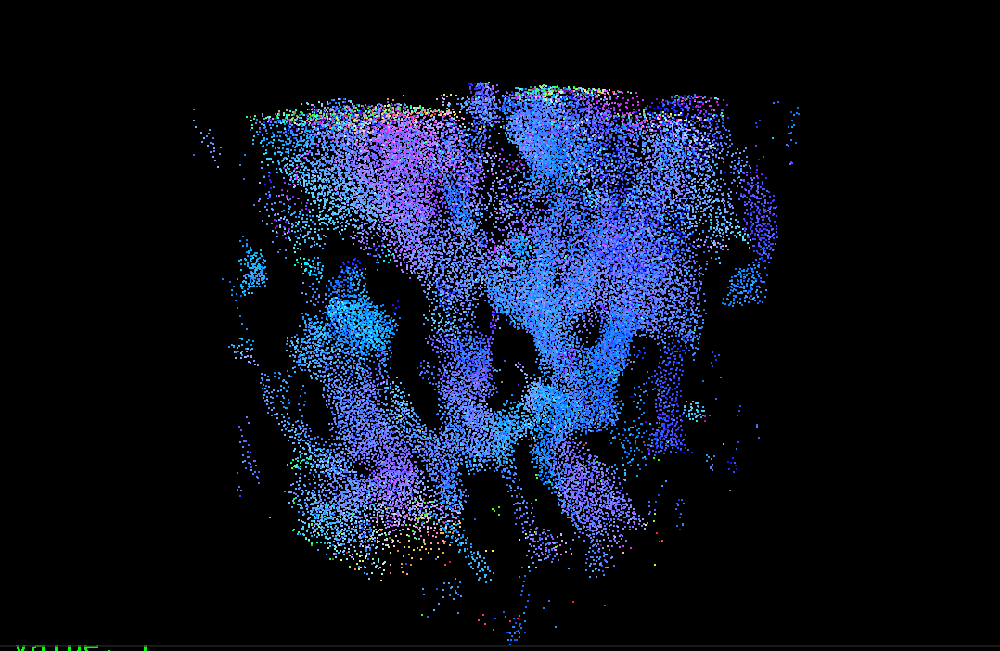
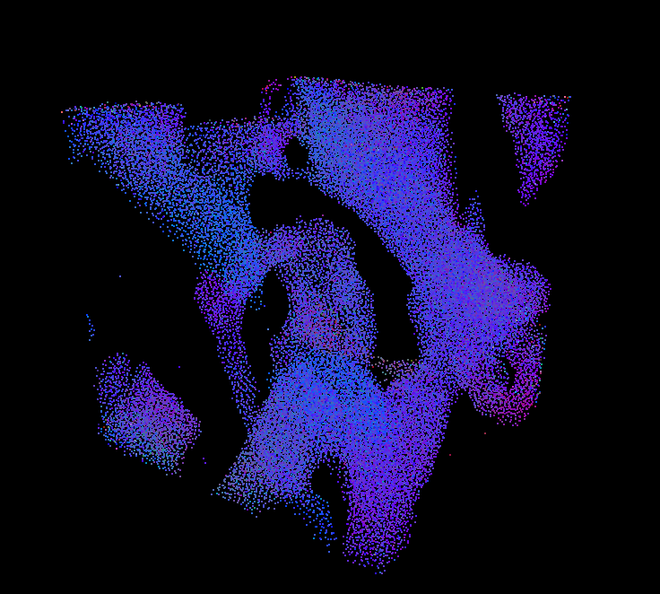
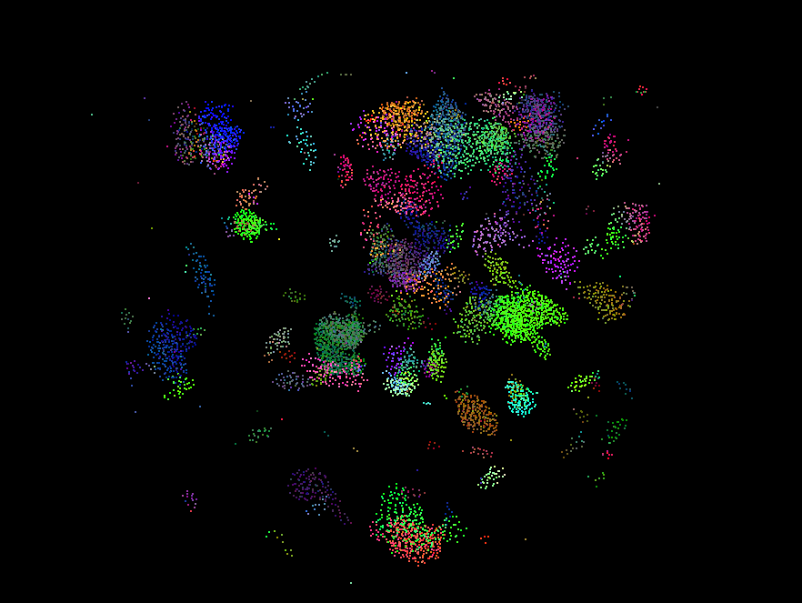
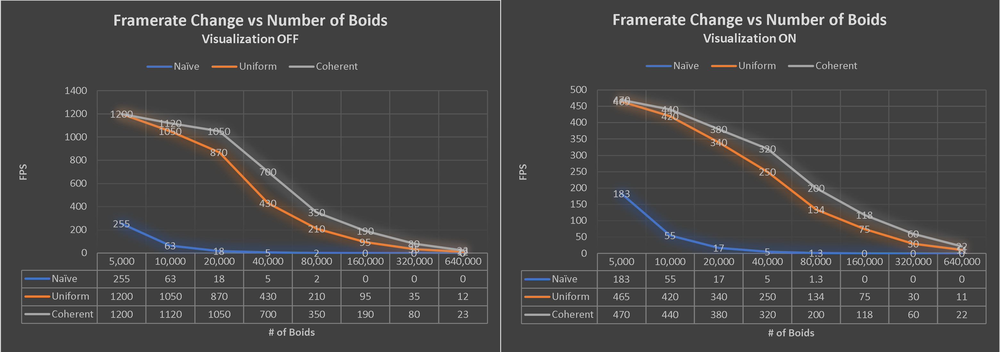
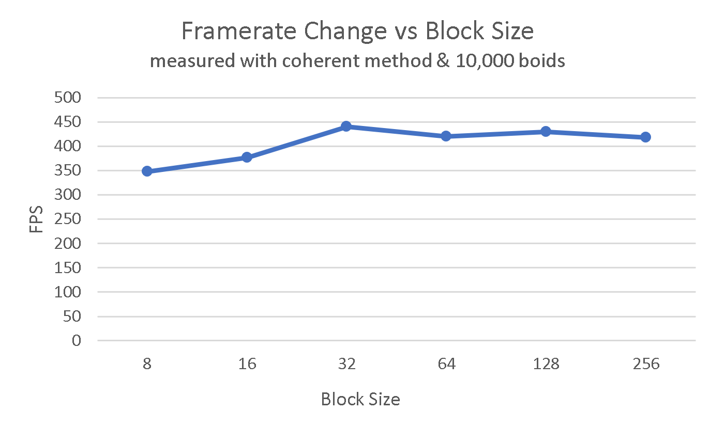

**University of Pennsylvania, CIS 565: GPU Programming and Architecture,
Project 1 - Flocking**

* Hanyu Liu
  * [personal website](http://liuhanyu.net/) 
* Tested on: Windows 10, Intel(R) Core(TM) i7-7700HQ CPU @ 2.80GHz 16.0GB, GeForce GTX 1050 (Personal)

### Demo & Results

Image 1: coherent mode, 50,000 boids

Image 2: coherent mode, 50,000 boids

Image 3: coherent mode, 10,000 boids

Gif: coherent mode, 50,000 boids

### Summary of Project

This is a simulation of boid flocks made out of thousands of particle points. During each update, every boid's position is calculated using its velocity, which is influenced by neighboring boids' positions. The flocking behavior follows three rules: 

- Rule 1: boids fly towards their local perceived center of mass, which excludes themselves
- Rule 2: boids try to stay a distance d away from each other    
- Rule 3: boids try to match the speed of surrounding boids

There are also three different type of update modes, each using a different method to search for neighbors: 

- Naive: for each boid, every other boid in the simulation is checked to see if it is close enough to apply an influence.
- Uniform: an optimization of the naive method. For each boid, only boids in neighboring cells are checked.
- Coherent: an optimization of the uniform method. The concept is the same, but we reduced an extra layer of indirection by directly rearranging the position and velocity buffers.

### Performance Analysis Graphs

### Analysis Questions

**For each implementation, how does changing the number of boids affect performance? Why do you think this is?**

For all implementations, increasing the number of boids decreases the performance (See Graph 1 Above) because there are more neighboring boids you would have to consider. However, when the number of boids is relatively low (<10,000), increasing the number of boids do not increase the performance of uniform or coherent grid methods as drastically. This is probably because the number of boids is low enough where its number does not have nearly as much of an impact on the performance as the amount of time it takes to set up the data structures. Thus, we do not see huge performance differences for lower numbers because similar datastructures need to be set up for both grid methods, which take a good amount of time.

**For each implementation, how does changing the block count and block size affect performance? Why do you think this is?**

For all implementations, increasing the number of block count will increase the performance if block count < 32. Otherwise, the performance is relatively the same, if not a little worse (See Graph 2 Above). This is most likely because my computer's warp size is 32, so any more increases in block size will simply use more cores, which does not increase your performance.

**For the coherent uniform grid: did you experience any performance improvements with the more coherent uniform grid? Was this the outcome you expected? Why or why not?**

The coherent uniform grid did result in performance improvements from the scattered uniform grid. This was expected because the reduction of the indirection step caused there to be less data on the cache. However, I didn't expect the performance increase to be so significant and noticeable! 

**Did changing cell width and checking 27 vs 8 neighboring cells affect performance? Why or why not? Be careful: it is insufficient (and possibly incorrect) to say that 27-cell is slower simply because there are more cells to check!**

If you decrease cell width, the performance decreases because you have to create larger buffers to accomodate the larger grid resolution. Since we have to have an index for every cell to keep track of a possible start or end index and every index needs to be set to a value during each update, this will cause the performance to decrease. However, if you increase cell width too much, you will have to search more boids, which will also decrease the performance (imagine if we have one cell the size of the scene scale. This would mean we are just doing the naive searching method!). Thus, scaling the cell width depending on the rule distances is optimal. 

Checking 27 cells vs 8 cells depends on a) how many boids are in those cells and b) how many of those boids fall within our rule distance so that they will actually influence our current boid. After all, there is a finite amount of boids that influence our current one, and we want to search our grids in a way where we make sure we hit every boid in this finite set while reducing non-relevant boids as much as possible. 

For example, 27 cells means (3 * cellwidth) ^3. We could have cellwidth = ruledistance / 2 and still make sure that all the boids that will influence our current boid will be in the area. This means that the total volume we are searching in is (3 * (ruledistance /2))^3. However, if we want to check 8 grids, the cellwidth has to = ruledistance * 2 in order to make sure we check all the necessary boids. This means that the volume we are seaching in is (2 * ruledistance * 2)^3. Thus, in this example, we see that we have to check a larger volume for the 8 cells, and depending on the number of boids, this means that we have to check a lot more extra boids! So we see through this example, with high boid density and small cellwidth, the performance will be better checking 27 cells than 8!

