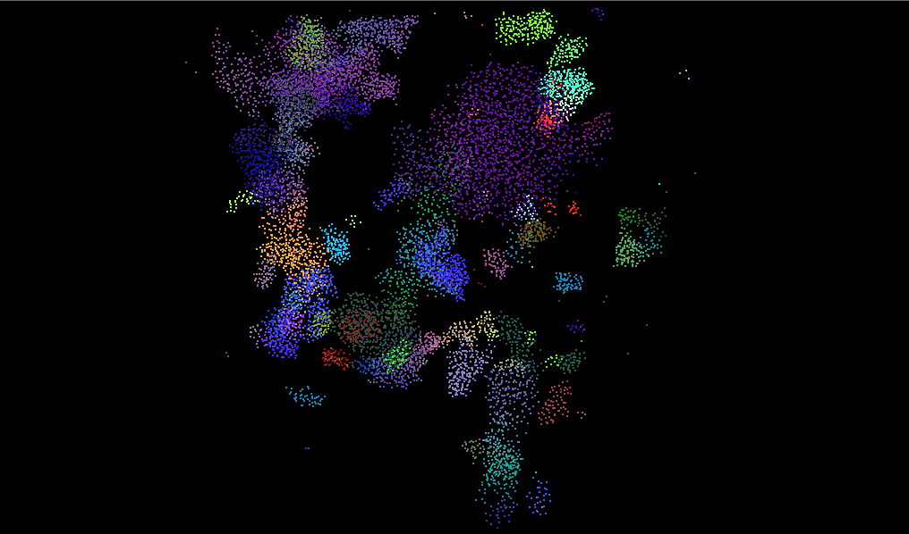
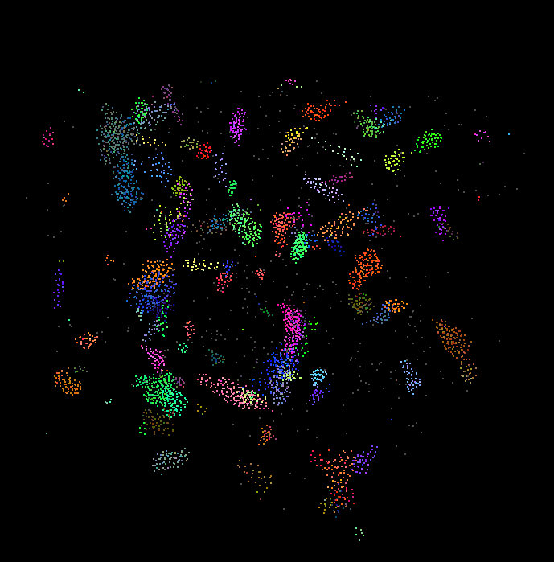
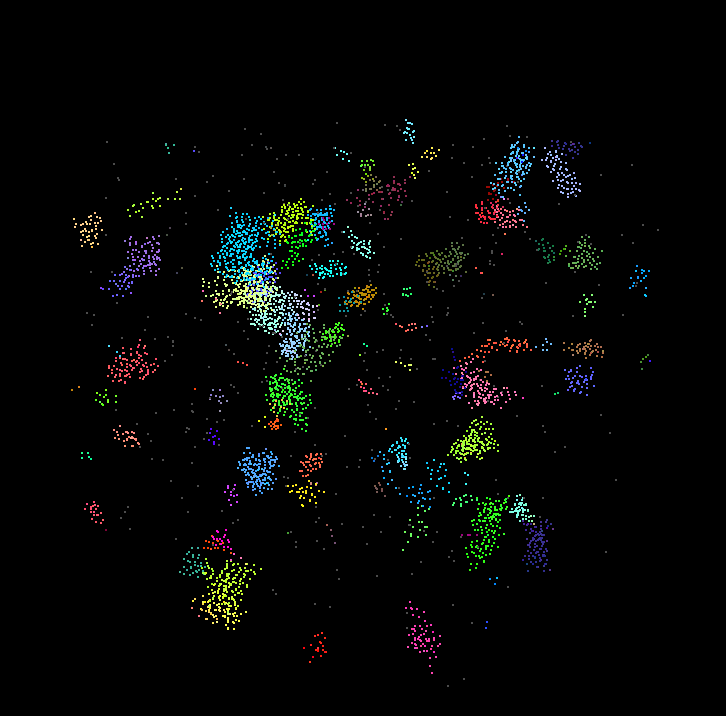
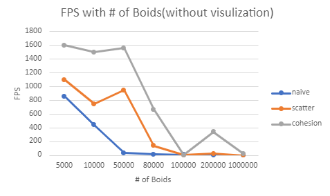
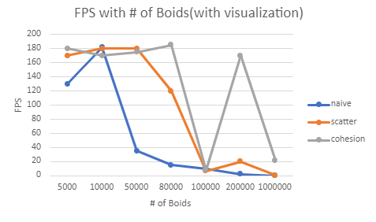
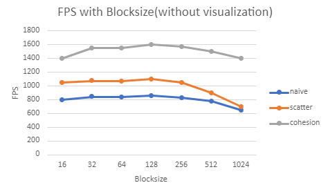
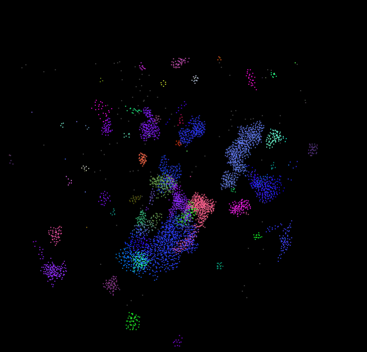

**University of Pennsylvania, CIS 565: GPU Programming and Architecture,
Project 1 - Flocking**

* Keyi Yu
  * https://www.linkedin.com/in/keyi-linda-yu-8b1178137/
* Tested on: Windows 10, i7-10750H @ 2.60GHz 16GB, GeForce RTX 2070 with Max-Q 8228MB (My Machine)

Project1-Flocking
=====================================

In this project, I implement a flocking simulation based on the Reynolds Boids algorithm, along with two levels of optimazation: a uniform grid, and a uniform grid with semi-coherent memory access.


Contects
-------------------------------------
- [Introduction](#Introduction)
- [Methods and Results](#Methods-and-Results)
  - [Method1: Brute Force](#Method1:-Brute-Force)
  - [Method2: Scatter](#Method2:-Scatter)
  - [Method3: Cohesion](#Method3:-Cohesion)
- [Performance Analysis](#Performance-Analysis)
- [Questions](#Questions)
- [Optimization](#Optimization)


## Introduction

Include screenshots, analysis, etc. (Remember, this is public, so don't put
anything here that you don't want to share with the world.)

## Methods and Results
In the Boids flocking simulation, we have to consider three rules:

1. cohesion - boids move towards the perceived center of mass of their neighbors
2. separation - boids avoid getting to close to their neighbors
3. alignment - boids generally try to move with the same direction and speed as their neighbors

The goal is to search for neighbors of each boid and to calculate the new velocity in terms of the above rules.
### Method1: Brute Force
Firstly, I implemented a naive neighbor search. Suppose we have N boids, we search the other N - 1 boids. In parellel programming, we can process each boid simultaneously. The following pircture shows the flocking with 5000 boids:

### Method2: Scatter
Recall that any two boids can only influence each other if they are within some neighborhood distance of each other. We can use a datastructure called uniform spatial grid to avoid checking useless boids. A uniform grid is made up of cells that are at least as wide as the neighborhood distance and covers the entire simulation domain. 


Then I follow the steps to implement this method:

1. Set up the uniform grid
2. "Bin" the boids into the grids
3. Sort the gridIndexArray and particleIndexArray by gridIndexArray
4. Find the subarray of gridIndexArray that represents all biods in a specific grid, storing the start index and end index in two new arrays. This will help me to identify which boids should I look into when I try to search boids in a grid.
5. Compute the grid that each boid belongs to, then find the neighboring grids according to the maxNeighborDistance.
6. Compute the new velocity according to the boids in the grids fount in step 5
7. Update position


### Method3: Cohesion
It is not efficient to get position and velocity of each boid with index as I implemented in Method2 because the memory is dicrete. So I can shuffle the postion array and velocity array before searching neighbors. In this way, the program can read memory continuously.


## Performance Analysis
Although the images I shown above are quite similar, the performance of each method are different.
### FPS vs Number of Boids without visualization
As we can see from the graph below, the cohesion grid uniform performs best and the naive search performs worst. From the overall trend, as the number of boids increases, the fps of the navie algorithm drops rapidly wheras the fps of the other two methods slowly drops.

In addition, the fps of the grid uniform method drops a little at the beginning. I guess that it costs some time to sort. I am confused that the fps is close to zero when the number of boids is around 100000 but increases later.



### FPS vs Number of Boids with visualization
The fps of the three methods are close at the beginning.  



### FPS vs Blocksize without visualization
Change in performance is negligible. Blocksize 128 and Blocksize 256 performs better. Explanation is - [here](#For-each-implementation,-how-does-changing-the-block-count-and-block-size-affect-performance?-Why-do-you-think-this-is?).



## Questions
### For each implementation, how does changing the number of boids affect performance? Why do you think this is?
1. Naive search: As the number of boids increases, fps drops quickly and is close to zero when the number of boids is around 50K. This is expected because the time complexity of this method is O(n * n). Although in parallel programming, we still need to check N - 1 boids. Therefore, fps and # of boids show negative linear correlation.
2. For uniform grid, the fps of this method drops more slowly as the number of boids increases. The reason is that this method only checks neighboring boids whose number is much smaller than N. Howerver, as the number of boids increase, boids in each cell will also increase. At last, the uniform grid method will also perform badly. 
3. I noticed that the grid uniform method performs well when the number of boids is in the range (100K, 1000K). I am not sure whether this is a bug and still looking for the reason for that phenomenon.


### For each implementation, how does changing the block count and block size affect performance? Why do you think this is?
The limit of threads in a block is 1024 on my machine, so I changes the blocksize from 16 to 1024. For the three methods, changing the blocksize doesn't affect the performance dramatically. They performs best when the blocksize is 128 or 256 and performs worse when the blocksize is larger than 256 or smaller than 128. This is because each block is in a multiprocessor and has limited resources. If we use smaller bloksize and more blocks, We will not make full use of every multiprocessor. If we use too much memory for threads in a block, there will be less resources for other instructions, which may slow down the processing speed.


### For the coherent uniform grid: did you experience any performance improvements with the more coherent uniform grid? Was this the outcome you expected? Why or why not?
Yes. It is expected. Since we store the position and velocity in continuous memory in advance, we can read data without extra indices when searching neighboring boids. Reading discrete memory is inefficient. in addition, the difference between the scatter grid uniform and the coherent uniform grid is almost constant. I think this is because the time for shuffle and indirect indices is constant.

### Did changing cell width and checking 27 vs 8 neighboring cells affect performance? Why or why not? Be careful: it is insufficient (and possibly incorrect) to say that 27-cell is slower simply because there are more cells to check!
Yes. It is hard to say which one is better. As the cell width increases, we can check less grids but each grid will contain more boids. In addition, if the maxDistance is smaller than the cell width, we may need to check some useless boids in the grid. That means it’s not that the fewer grids the better. On the other hand, if the cell width is too small, we need more memory to store grids. This case is simliar to the naive search. Therefore, we need to find a optimal cell width for uniform grid.

## Optimization
### Grid-looping optimization (Implemented in Scatter Uniform Grid)
Firstly, we get a maxDistance which statisfies the distance limits of three rules. This distance is the radius of our searching area.
```
maxDistance = max(rule1Distance, max(rule2Distance, rule3Distance))
```
Upon we get the maxDistance, we can compute the furthest grid that we can reach.
```
maxGrid = thisBoid + maxDistance
minGrid = thisBoid - maxDistance
```
Then we just need to iterate within the range [minGrid, maxGrid]. In addition, we need to clamp the position to keep the grid position in the cube. In this method, we don't need to hard-code the start grid and the end grid.


