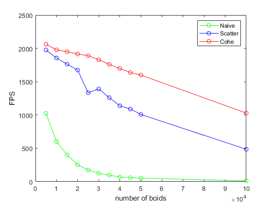
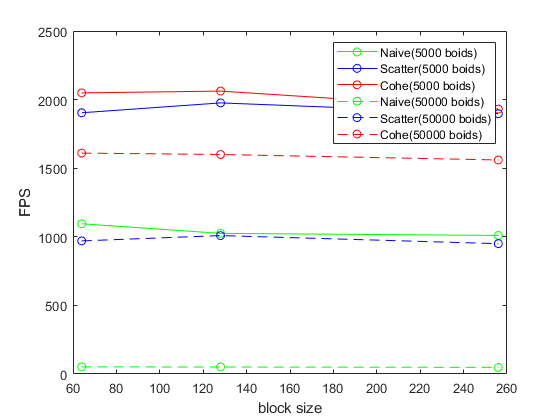

# Project 1 - Flocking
**University of Pennsylvania, CIS 565: GPU Programming and Architecture, Project 1 - Flocking**

* Dayu Li  
*[LinkedIn](https://www.linkedin.com/in/dayu95/)
* Tested on: Windows 10, i7-10700K @ 3.80GHz 16GB, GTX 2070 8150MB (Personal laptop)

## Screenshots
| 5,000 Boids | 100,000 Boids |
|--|--|
| |  |
## Performance Analysis

##### For each implementation, how does changing the number of boids affect performance? Why do you think this is?

  
When the visualization is set to be off, increasing the number of boids will generally lead a drop down for the fps. The reason is pretty straightfoward, since are more boids in the space will increase the computations for each frame. Different methods behave uniquely for the drop down rate. For Naive, the fps decrease rapidly from 5,000 to 20,000, from ~1000fps to ~20 fps. As for Uniform Grid and Coherent Grid, the fps decrease slowly before 30,000 and rapidly after 30,000.  

When the visualization is set to be on, the fps doesn't change rapidly and stay in a low range, which is due to the heavy duty of copying additional data to VBOs.  
##### For each implementation, how does changing the block count and block size affect performance? Why do you think this is?

  
Changing block count and block size doesn't draw a obvious change of fps in my program. My hppothesis is that the block size and thread numbers in CUDA is fixed and has nothing to do with the block size and block count set in the code. CUDA will rearrange the threads to maximize the ability of computations.

##### For the coherent uniform grid: did you experience any performance improvements with the more coherent uniform grid? Was this the outcome you expected? Why or why not?

Yes. Compared with the scattered uniform grid, using coherent uniform grid will lead to a obvious incrase of fps under the same boids number. This increase varies from different boids numbers. The larger the number is, the greater coherent can do. This is due to the fact that the data of boid's velocity and location are greater distributed and thus takes more memory spaces, increasing the rate of cache miss.  
##### Did changing cell width and checking 27 vs 8 neighboring cells affect performance? Why or why not? Be careful: it is insufficient (and possibly incorrect) to say that 27-cell is slower simply because there are more cells to check!

Using half the cell width slightly affects the performance, making the fps larger or smaller, it depends on the number of boids. When the number of boids is small, using 27-cell will decrease the fps, it's because that the boids number is small so the computation of checking 27 directions instead of 8 will play a more important role for each frame. However, when the boid number is large, decreasing the number of candidates to be checked by a half is doing more positively than the negative effects generated by checking 27 directions. Which will lead to a increase of fps. In general, it's hard to determine which method is better.    
Tested with Coherent Uniform Grid:  
||8 Cells, Full Width| 27 Cells, Half Width
|--|--|--|
|5k Boids|2098 FPS|2013 FPS|
|50k Boids|1645 FPS |1406 FPS|
|100k Boids|1146 FPS |1280 FPS|
