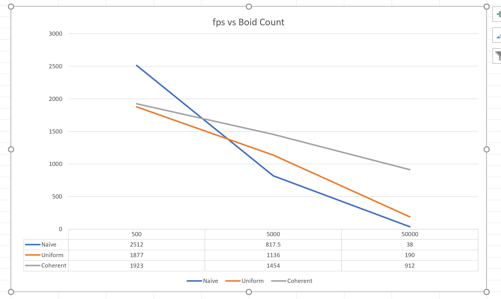

<h1> CUDA Flocking Simulation with Reynold Boids Algorithm

# 

**University of Pennsylvania, CIS 565: GPU Programming and Architecture,
Project 1 - Flocking**
* Haorong Yang
* [LinkedIn](https://www.linkedin.com/in/haorong-henry-yang/)
* Tested on: Windows 10 Home, i7-10750H @ 2.60GHz 16GB, GTX 2070 Super Max-Q (Personal)

This is a CUDA based simulation of the Reynold Boids Algorithm. Three approaches were taken to perform neighbor search.
The Naive approach does a brute force search through every other boid to update one boid.
The Uniform Grid and Coherent Grid searches through the cells within its search radius, 
but Coherent Grid has a modification in the method of accessing elements.

The method used to compare performance was by frame rate under different boid counts.
I took the lowest and highest frame rate that appeared at least twice within the first minute, 
and took the average of that as the performance result.

Comparison of 3 methods of step simulation, at most 8 neighbors (Naive Search, Uniform Grid, Coherent Grid):

Comparison of 3 methods of step simulation, at most 27 neighbors (Naive Search, Uniform Grid, Coherent Grid):

* As the number of boids increase, the performance decreases as we could observe that the frame rates decrease. The reason for this is the arrays become longer and there is simply more calculation to do as there are more boids.
* The coherent grid method showed greater performance as the boid count increases to a large number. At smaller number of boids, there is barely noticable increase in performance compared to the uniform grid. This is the outcome as I expected, because as the boid count increases, the cost to access boidIndices and then positions and velocity becomes more significant since they are performed in for every single neighbor search, whereas shuffling of the position and velocity arrays only need to happen once every step simulation
* In 27 neighbor search, coherent still performs the best.
