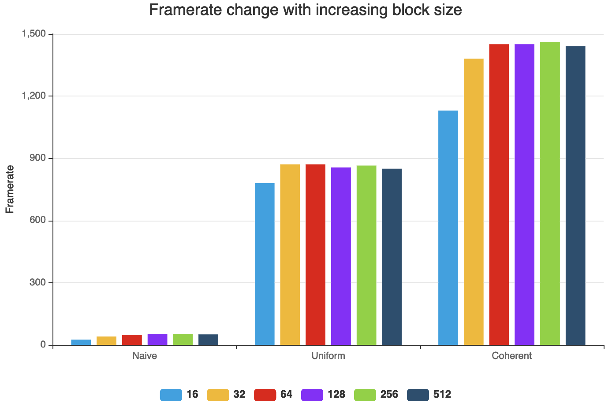
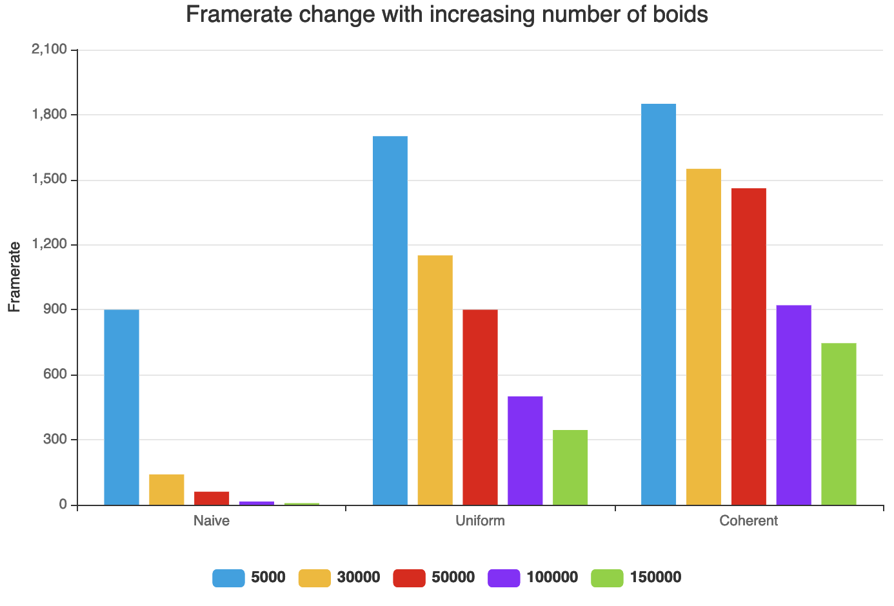

**University of Pennsylvania, CIS 565: GPU Programming and Architecture,
Project 1 - Flocking**

* Haoyu Sui
  	* [LinkedIn](http://linkedin.com/in/haoyu-sui-721284192)
* Tested on: Windows 10, i5-9600K @ 3.70GHz 16GB, RTX 2070 SUPER 8GB 
* SM：7.5

### My results:

Naive Neighbor Search

Uniform grids

More coherent uniform grids

### Questions

- **For each implementation, how does changing the number of boids affect performance? Why do you think this is?**

	Adding the number of boids will increase the calculation time and reduce the refresh rate, so performance will decrease.
	First, if there are more boids, we need to update the position and speed of more boids, which means more calculations. Secondly, for a boid, it may have more neighbor boids than before, which will also increase the amount of calculation. Moreover, more boid means more memory needs to be accessed, which also increases time.

- **For each implementation, how does changing the block count and block size affect performance? Why do you think this is?**

	From my test, changing the block size will change the fps, in the block, so it will affect the performance.
	In the process of increasing the block size, the fps will increase first, and then there will be no major changes. My idea is that performance may be related to both warp size and block size. When the warp size is sufficient, increasing the block size will improve performance. When the warp size starts to be affected, increasing the block size will not continue to improve performance.

- **For the coherent uniform grid: did you experience any performance improvements with the more coherent uniform grid? Was this the outcome you expected? Why or why not?**

	Yes. According to my test, the result of the coherent uniform grid will be better than that of the uniform grid. The result is within my expectations, because in the uniform grid, the velocity and position data of the boids are scattered all over the place. After we reshuffle the data, all the velocities and positions of boids in one cell are contiguous in memory, so this data can be accessed faster.

- **Did changing cell width and checking 27 vs 8 neighboring cells affect performance? Why or why not? Be careful: it is insufficient (and possibly incorrect) to say that 27-cell is slower simply because there are more cells to check!**

	According to my test, checking 27 cells is faster than checking 8 cells. Because the volume when checking 27 cells is actually smaller than checking 8 cells due to a smaller side of the cell, there are fewer neighbor boids, so the performance will be better. Especially when the number of boids is relatively large, their performance differences will be more obvious.

### Analysis Graphs

Framerate change with increasing block size

Framerate change with increasing number of boids

