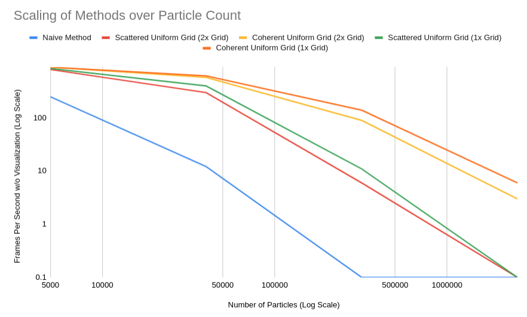
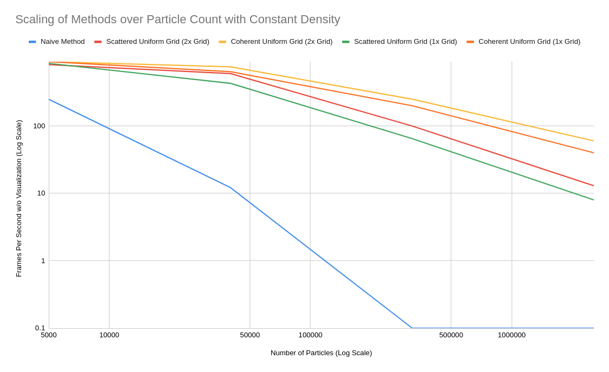
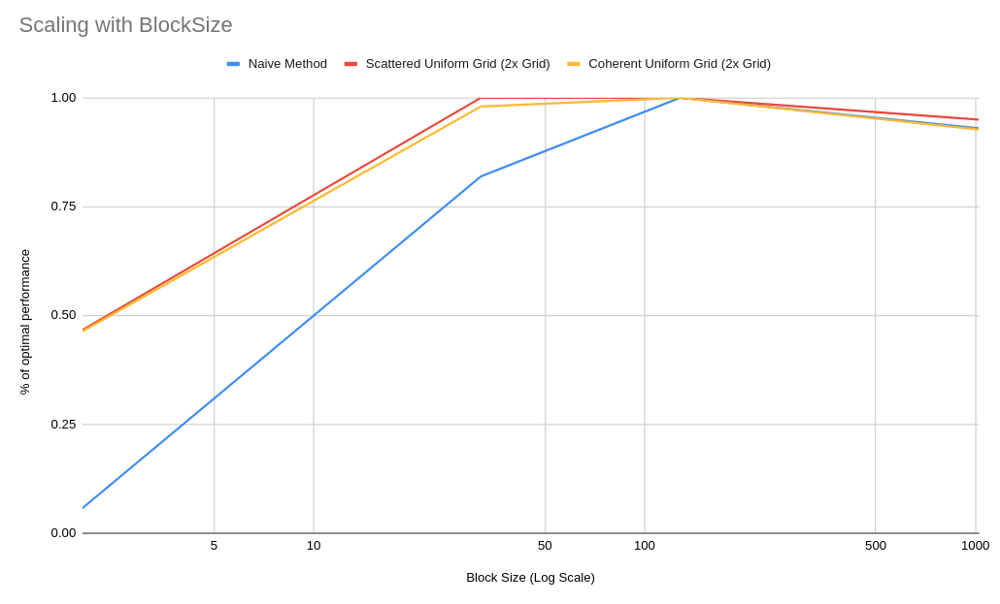

**University of Pennsylvania, CIS 565: GPU Programming and Architecture,
Project 1 - Flocking**

NAME: CHETAN PARTIBAN 

GPU: GTX 970m (Compute Capability 5.2) 

Tested on Windows 10, i7-6700HQ @ 2.60 GHz 16Gb, GTX 970m 6Gb (Personal Laptop) 

### (TODO: Your README)

For this project, I just used FPS as a measurement of relative performance. Although it is indeed quite a crude measurement method, because the difference across methods is quite large, the differences still present themselves even with this performance measure. For all the tests, I turned off visualizations to prevent the framerate from being capped at 60hz. I performed three different performance tests to understand the performance of the different methods more thoroughly.

1. I tested the affect of just increasing particle count on the FPS. This increases the number of boids to be simulated, as well as the density of the boids in the grid.
2. I tested the affect of increasing the particle count and grid size together such that the density of boids remains constant. 
3. I tested the affect of changing the blockSize across all methods whilst using 40000 boids for the simulation.

For the first two tests, I use 5 different methods. 

1. Naive Method
2. Scattered Uniform Grid with the CellWidth set to 2x the Boid effect radius
3. Coherent Uniform Grid with the CellWidth set to 2x the Boid effect radius
4. Scattered Uniform Grid with the CellWidth set to 1x the Boid effect radius
5. Coherent Uniform Grid with the CellWidth set to 1x the Boid effect radius

For the final test, I only use the first three of these methods, since I didn't think that the CellWidth and blockSize would have interesting interactions that we would have to consider in our analysis. 

In the first test, I found that using the Grid with CellWidth set to 1x was optimal and that the Coherent Uniform Grid outperformed the Scattered Uniform Grid, which in turn outperformed the Naive Method. This seems to fall in line with our expectations, as our more complicated methods are showing the performance benefits that we would expect, and particulary we can see that they scale much better with the number of particles than the naive method. The plot below is using a log scale on both the x and y axis to make the differences clearer. 

In the second test, I found the same relationship between the Naive, Scattered Uniform Grid, and Coherent Uniform Grid methods. However, I saw a flip-flop between the 1x and 2x grid scales. In this case, the 2x Grid scale significantly outperforms the 1x Grid Scale. I think this likely has to do with the way that looping in the hardware works. When we have a smaller number of cells to check, we have less opportunity for divergence between our threads, which allows for more efficient use of our computation. However, in higher density environments, this gets outweighed by the fact that in the 2x Grid Scale, we are checking over a larger volume than the 1x Grid Scale. This is because when our grid is 1x the Boid effect radius, the volume we are searching is 3x3x3=27 but when we use 2x the Boid effect radius, it is 4x4x4=64. Therefore, it seems that the relative performance between these two grid scales is a balance dependent on the density of the boids. In more dense environments, we want to optimize for less volume searched (1x Boid effect radius), but in less dense environments we want to optimize for less thread divergence (2x Boid effect radius). 

In the third test, I found that we see large performance drops with very small blockSize and small performance drops with very large blockSize. For intermediate values, I saw little performance difference across blockSizes. This is probably due to the fact that the GPU hardware is organized to run in warps of 32, so if the blockSize is less than 32, there is extra scheduling that must occur to fully utilize each warp. Similary, when the blockSize gets to its peak values of 1024, there may be some schedule issues in the GPU due to memory constraints or more wasted computation due to incomplete blocks being run. In the plot below, I tested all three methods using 40000 boids for the simulation without any visualization. The y-axis is normalized across methods to be the % of frames relative to the optimal value for that method (scaled between 0-1) so that they can be more easily compared on the same chart. 

Overall, for each method we see a decrease in performance as number of boids increases, as we would expect. We see the biggest decrease in the Naive method which checks all boids and decreases in performance linearly with the number of boids. For the Scattered and Coherent Uniform Grid implementations, we see significantly better scaling, as they are able to limit their volume significantly. For these methods, they scale dependent on the density of the boids and the radius within which boids can interact as well as the overall number of boids. This ends up improving the scaling for these methods. For all the methods, we see that they are relatively blockSize agnostic, with significant performance decreases only seen at extreme blockSize values. These effects at the extreme ends likely have to due with scheduling difficulty of the blocks due to hardware constraints. For the coherent grid, we saw an improvement over the scattered grid implementation, especially as the density of the boids increased. This is due to the fact that, if more boids that exist in each cell, we get to do longer consecutive reads, which increases the benefits we get over the random reads that occur in the scattered grid implementation. Finally, we found that the performance of differing CellWidth values depends on the density of the boids. In high density cases, you want to prioritize reducing the search volume and should use the 1x radius CellWidth. In lower density cases, you want to prioritize reducing the looping and potential divergence between threads and should use the 2x radius CellWidth. 
