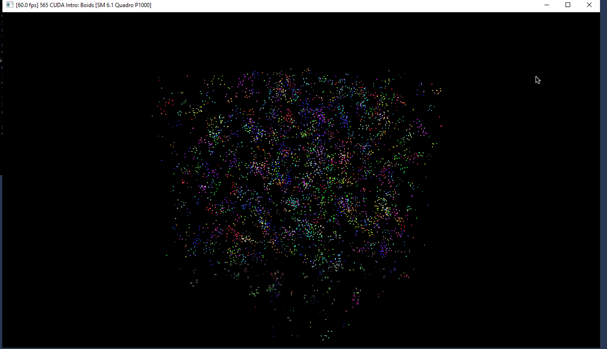
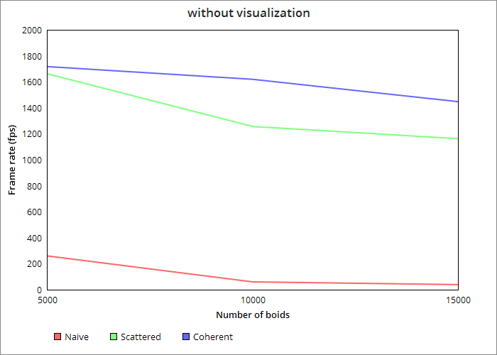
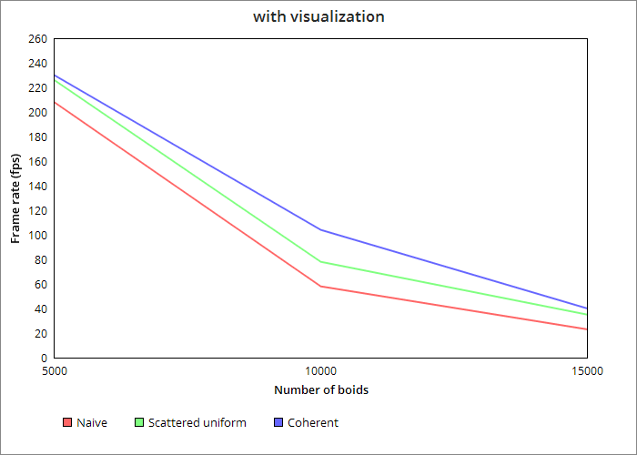
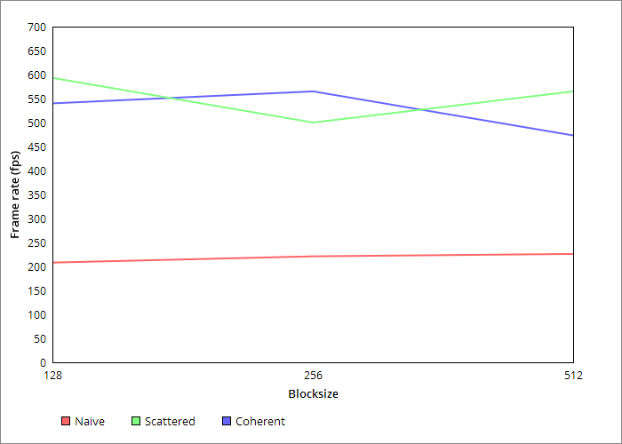

**University of Pennsylvania, CIS 565: GPU Programming and Architecture,
Project 1 - Flocking**

* Han Yan

* Tested on: CETS Virtual Lab

### (TODO: Your README)

Include screenshots, analysis, etc. (Remember, this is public, so don't put
anything here that you don't want to share with the world.)

## Performance Analysis

### Simulation (some parts are laggy since I recorded from my host computer)

### Changing number of boids

### Changing block size

