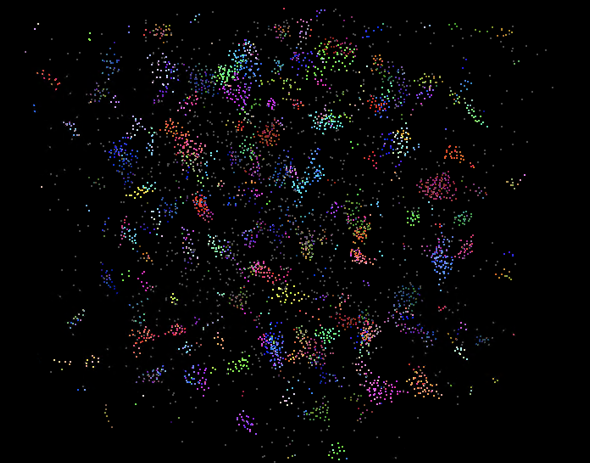
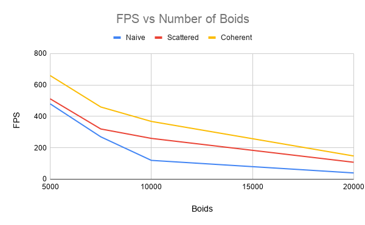
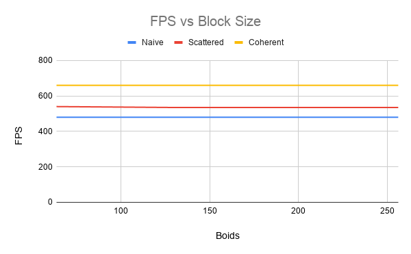

**University of Pennsylvania, CIS 565: GPU Programming and Architecture,
Project 1 - Flocking**

* Sydney Miller
  * [LinkedIn](https://www.linkedin.com/in/sydney-miller-upenn/)
* Tested on: GTX 222 222MB (CETS Virtual Lab)

### README

### Boids

### Performance Analysis

#### For each implementation, how does changing the number of boids affect performance? Why do you think this is?
My hypothesis was that performance would decrease as the number of boids increased. I saw that the performance decreased when the number of boids increased. I beleive this happened because there is more computation required when the number of boids is increased, so the program will not run as fast. 

#### For each implementation, how does changing the block count and block size affect performance? Why do you think this is?
My hypothesis was that the larger block sizes would increase performance, however the performance remained almost the same as the block size increased. This could be because the block size is considered when defining the fullBlocksPerGrid dimension, so the performance remains relatively constant with the tested block sizes.  

#### Did you experience any performance improvements with the more coherent uniform grid? Was this the outcome you expected? Why or why not?
Yes, I experienced better performance with the coherent uniform grid, which is what, which is what I expected to happen. I expected the performance to be better because the scattered grid required an additional memory look up whereas the coherent grid uses the same index as the grid indices. The additional memory look up slows down performance. 

#### Did changing cell width and checking 27 vs 8 neighboring cells affect performance? Why or why not?
It slightly changed the performance, but not by a significant amount. I expected the performance to be better for 8 neighboring cells compared to 27 neighboring cells. For Naive, 8 neighboring cells was 480 FPS and 27 neighboring cells was 480 FPS. For Scattered, 8 neighboring cells was 512 FPS and 27 neighboring cells was 550 FPS. For Naive, 8 neighboring cells was 660 FPS and 27 neighboring cells was 650 FPS. This could be because 8 and 27 are relatively small constant numbers, and since these calculations are done in parallel the difference isn't that much greater. Each of them is still iterating over a 3D space, one is just slightly larger than the other.
