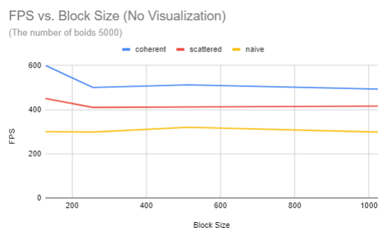
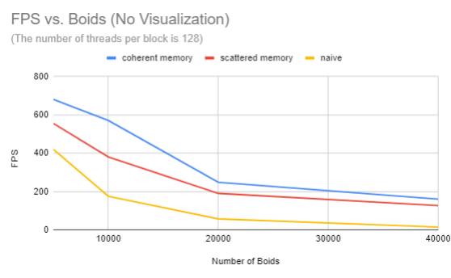
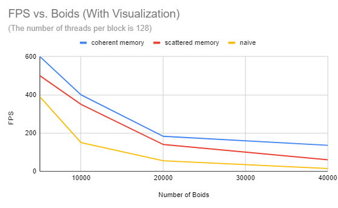

* Thy (Tea) Tran 
  * [LinkedIn](https://www.linkedin.com/in/thy-tran-97a30b148/), [personal website](https://tatran5.github.io/), [email](thytran316@outlook.com)
* Tested on: Windows 10, i7-8750H @ 2.20GHz 22GB, GTX 1070

# Flocking
This CUDA project is based on Reynolds Boids algorithm to simulate Boids flocking behaviors. Particles represent birds or fish in the simulation. The simulation is completed in three different ways: naive method, a uniform grid and a uniform grid with semi-coherent memory access.

## Features 
Boids (particles) move around the simulation space according to these three rules:
1. cohesion - boids move towards the perceived center of mass of their neighbors
2. separation - boids avoid getting to close to their neighbors
3. alignment - boids generally try to move with the same direction and speed as
their neighbors
These three rules specify a boid's velocity change in a timestep.
At every timestep, a boid thus has to look at each of its neighboring boids
and compute the velocity change contribution from each of the three rules.

### Naive
* For each boid, consider all other boids as neighbors and check if their distance is close enough to apply any of the mentioned rules

### Uniform 
* Having each boid check every other boid is very inefficient, especially if (as in our standard parameters) the number of boids is large and the neighborhood distance is much smaller than the full simulation space. We can cull a lot of neighbor checks using a uniform spatial grid data structure.
* A uniform grid is made up of cells that are at least as wide as the neighborhood
distance and covers the entire simulation domain.
* If the cell width is double the neighborhood distance, each boid only has to be
checked against other boids in 8 cells in 3D.
* We construct the uniform grid by sorting. If we label each boid
with an index representing its enclosing cell and then sort the list of
boids by these indices, we can ensure that pointers to boids in the same cells
are contiguous in memory.
* Then, we can walk over the array of sorted uniform grid indices and look at
every pair of values. If the values differ, we know that we are at the border
of the representation of two different cells. Storing these locations in a table
with an entry for each cell gives us a complete representation of the uniform
grid. This "table" can just be an array with as much space as there are cells.
This process is data parallel and can be naively parallelized.

### Uniform with semi-coherent memory access
* The uniform grid method above has a disadvantage of having the boid data itself (velocities and positions) scattered all over the place.
* Hence, the runtime is increased by rearranging the boid data itself so that all the velocities and positions of boids in one cell are also contiguous in memory

## Performace Analysis

