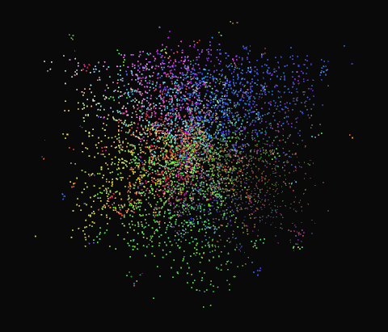
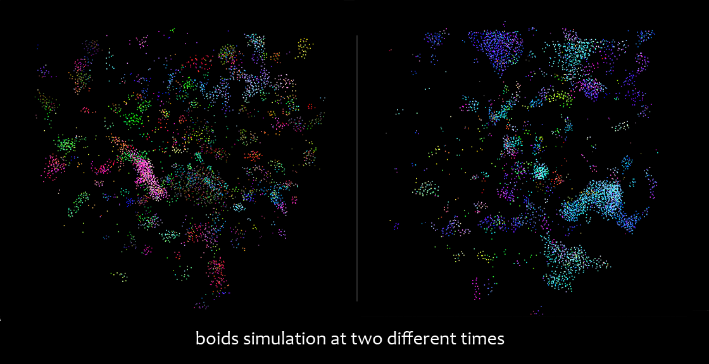
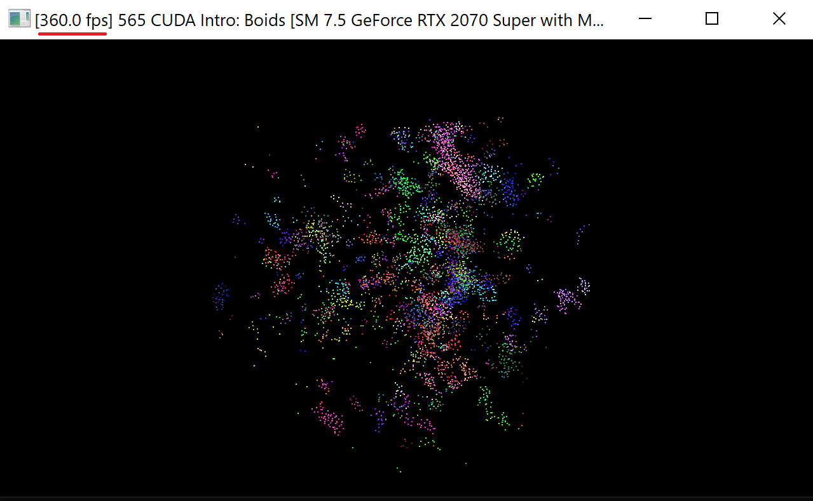
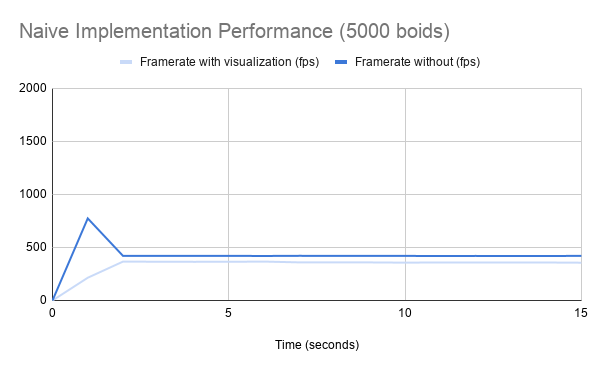
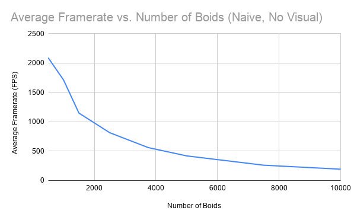

**University of Pennsylvania, CIS 565: GPU Programming and Architecture,
Project 1 - Flocking**

* Janine Liu
  * [LinkedIn](https://www.linkedin.com/in/liujanine/), [personal website](https://www.janineliu.com/).
* Tested on: Windows 10, i7-10750H CPU @ 2.60GHz 16GB, GeForce RTX 2070 8192 MB (personal computer)

# Boids Simulation

This project involved a flocking simulation derived from the Reynolds Boids algorithm, with three different setups / implementations that were compared for performance.

# Performance Analysis Methods

The main measure of the simulation's performance is its, displayed in the top left corner of the window when the simulation runs. 

;

The program does not generate framerate graphs automatically, so instead of eyeballing an average, I gathered data by recording the application window for fifteen seconds. Using this video, data points could be created for the framerate at every second in the recording, and then plotted on time graphs as shown in the following sections. Since the graphic visuals of the simulation take resources to update (reducing the framerate of the simulation), I have also taken framerate data for when this visualizer is turned off. Clearly, these values will be higher than their visualized counterparts.

When the simulation starts, the first two values shown are always "0.0 fps", followed by an outlier number that is much higher or lower than the rest of the values for that trial. Therefore, when I take the average framerate from my data, I discount these two numbers so the average is a more accurate representation of the framerate once its initial spikes have settled.

## Naive Implementation

In the naive implementation of this simulation, every boid checks against all other boids to calculate its velocity, even those that should have been outside of its search radius. The framerates were captured on my computer as below with a count of 5000 boids.

;

This method is essentially an  algorithm; with a large number of boids in the simulation, the squared amount of time that this method takes results in the lowest framerate of the three implementations. To confirm this, I measured the average framerate for a varying number of boids in the unvisualized simulation, resulting in the inverse parabolic trajectory shown:

;

## Uniform Grid

Disabling vertical sync on my device results in a framerate exceeding 60fps, even with visualization turned off. I include the statistics for both visualization on and off.

###Grid Looping Optimization

Since the distances of 

## Coherent Data Buffers
