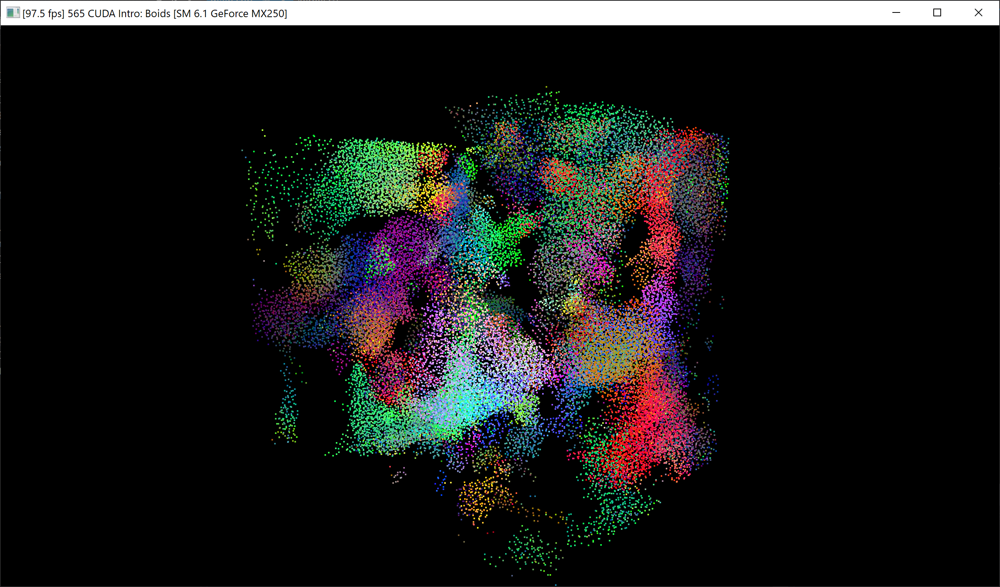
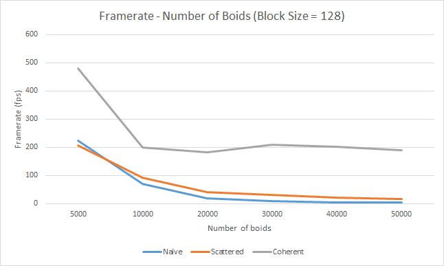
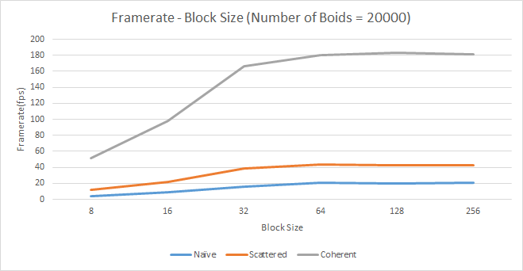

**University of Pennsylvania, CIS 565: GPU Programming and Architecture,
Project 1 - Flocking**

* Szeyu Chan
  * [LinkedIn](https://www.linkedin.com/in/szeyuchan11/)
* Tested on: Windows 10, i7-10510U @ 1.80GHz 16GB, MX250 2048MB (Personal Laptop)

### Results

### Analysis
#### Number of Boids

It is apparent that the number boids will affect performance. For the naïve method, we need to iterate all the boids, whose complexity is O(n^2), so the framerate decreases significantly with the increase of the number of boids. For the scattered grid method and the coherent grid method, because of the O(1) neighbor search, the performance is affected slightly.

#### Block Size

When increasing the block size from 8 to 64, the performance is improved, while from 64 to 256, the framerate is stable. One possible reason is that when the size is less than 32, there are some idle threads in a warp, so the processors are not fully utilized.

#### Scattered Grid VS Coherent Grid
As shown in the above two figures, the coherent grid method has a better performance than the scattered grid method. The overhead of reshuffling data is far more less than the overhead of random memory access. So it is important to keep the locality.

#### Cell Width
* Number of Boids = 20000, Block Size = 128  
* 8 neighbors: Cell Width = 2 * Max Distance, FPS = 182  
* 27 neighbors: Cell Width = 0.5 * Max Distance, FPS = 176 
 
It seems the performance is not affected. One possible reason is that although the number of neighbor cells increases, the number of boids in each cell decreases, so the total number of boids that will be checked is similar.
