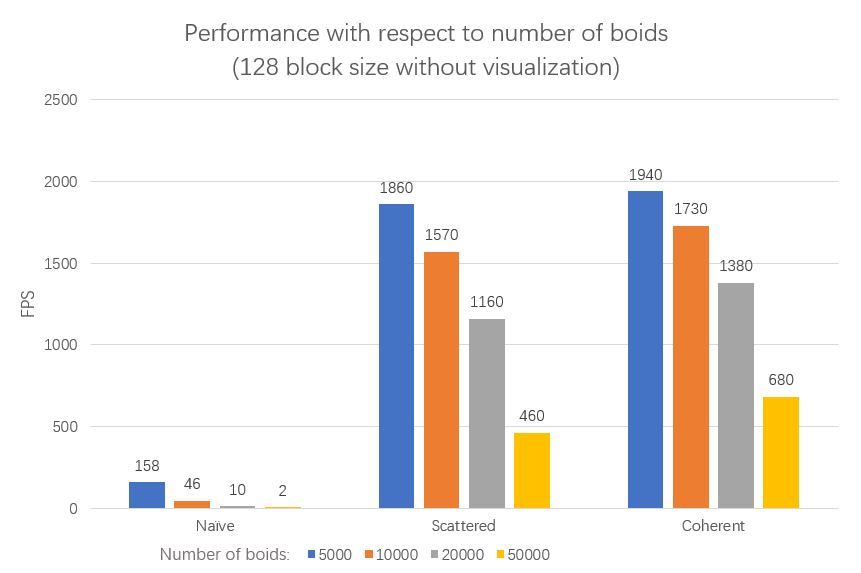
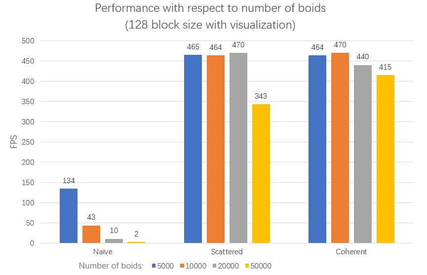
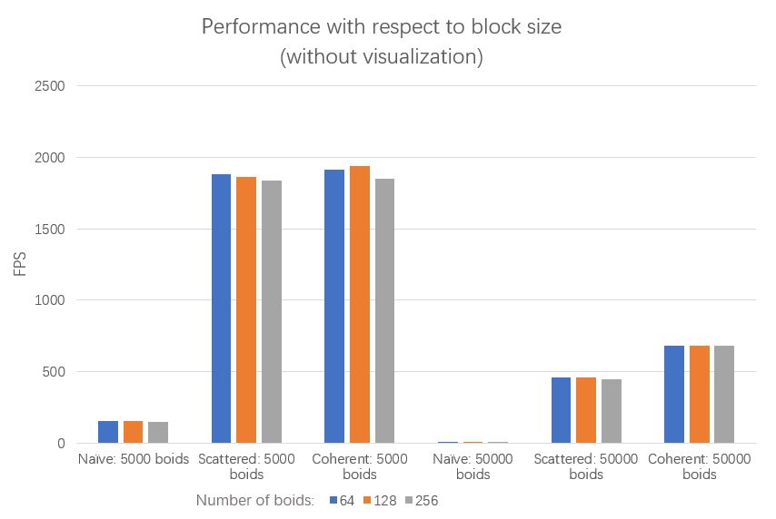
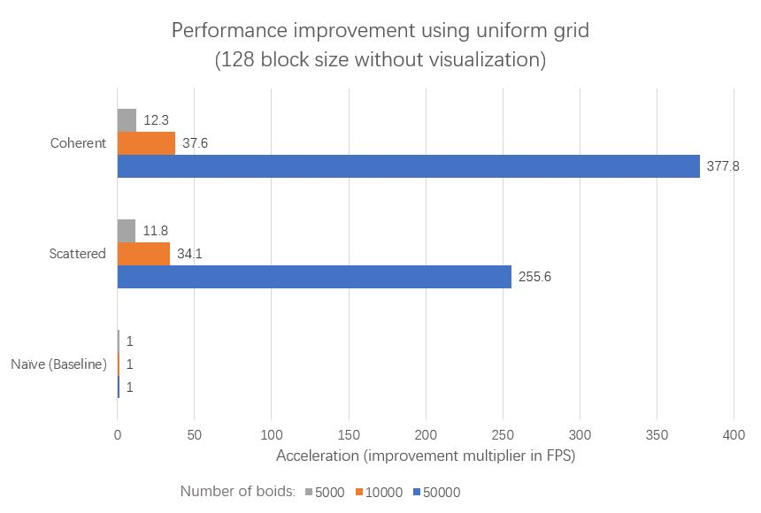
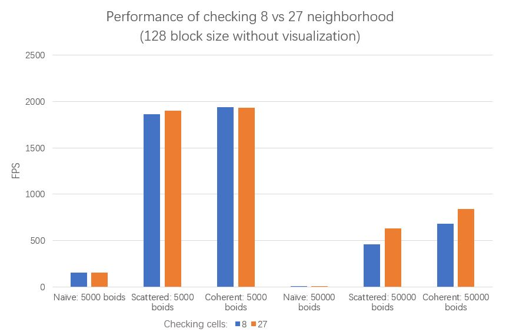
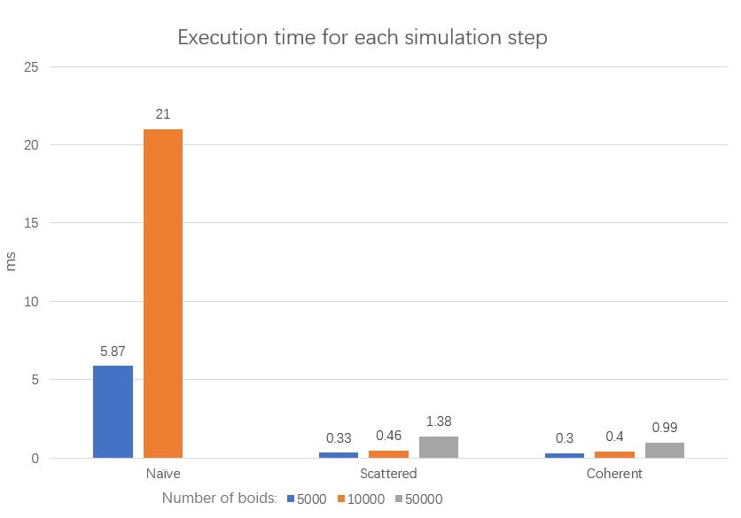

**University of Pennsylvania, CIS 565: GPU Programming and Architecture,
Project 1 - Flocking**

* Jilin Liu
  * [LinkedIn](https://www.linkedin.com/in/jilin-liu97/), [twitter](https://twitter.com/Jilin18043110).
* Tested on: Windows 10, i7-8750H @ 2.20GHz, 16GB, GTX 1050Ti 4096MB (personal)

## Results 

Demo of flocking with 50000 boids using coherent grid acceleration. Details about the uniform grid structure is discussed in the [instruction](./INSTRUCTION.md).

## Performance Analysis

### Number of boids
**Q1:** For each implementation, increasing the number of boids will cause lower FPS, which is expected. The reason is that when the number of boids is greater than the number of threads that GPU can schedule to run in parallel, those threads will need additional cycles to get executed. And this additional cycle number is proportioanl to the number of boids so we can see a decrease in FPS as we increase the number of boids.

When turning on the visualization, the performance of each implementation suffers since we are copying additional data to VBO to be used for OpenGL.

### Block size
**Q2:** Changing the block size does not have a noticable impact on the performance. My hppothesis is that CUDA will rearrange the threads in blocks so that in each cycle there will still be as many threads as there could to run in parallel. Even though such rearrangement has overhead, the performance is dominated by other factors like the number of boids.

### Coherent uniform grid
**Q3:** I do get a performance improvement with the more coherent uniform grid. The improvement is even greater with a larger number of boids. This outcome is expected because when the number of boids is greater, the particle velocity and position data are highly distributed and thus each boid needs to access a large portion of memory, increasing the count of cache miss. When we are reshuffling the particle data array, we also need to access different part of the memory but this happens only once.

### Checking 27 vs 8 neighboring cells
**Q4:** Checking 27 neighboring cells in my simulation is actually faster than checking 8 cells. This difference is more obvious when number of boids is larger. Suppose d is the maximum search distance of the 3 rules. When we check 27 neighbors, the side of each cell is d, so we are checking a space of volume (3d)3. On the other hand, when we check 8 neighbors, the side of each cell is 2d, so we are checking a space of volume (2\*2d)3. When there are a lot more boids in the scene, the data is dense in space and checking a larger volume means we have to discard more candidates, which causes worse performance.

### Time measurement
A general time measurement for these three methods is shown below.

