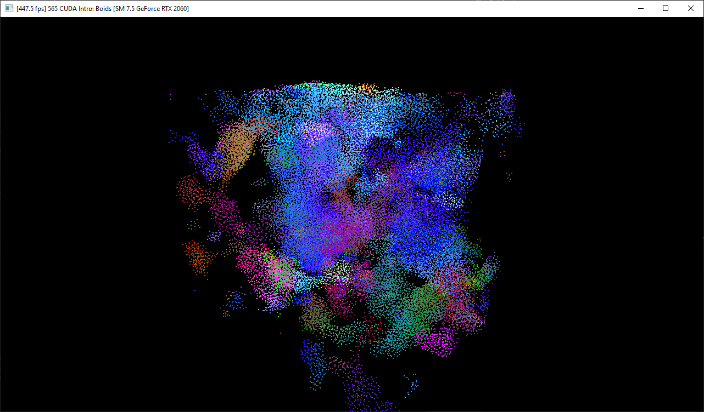
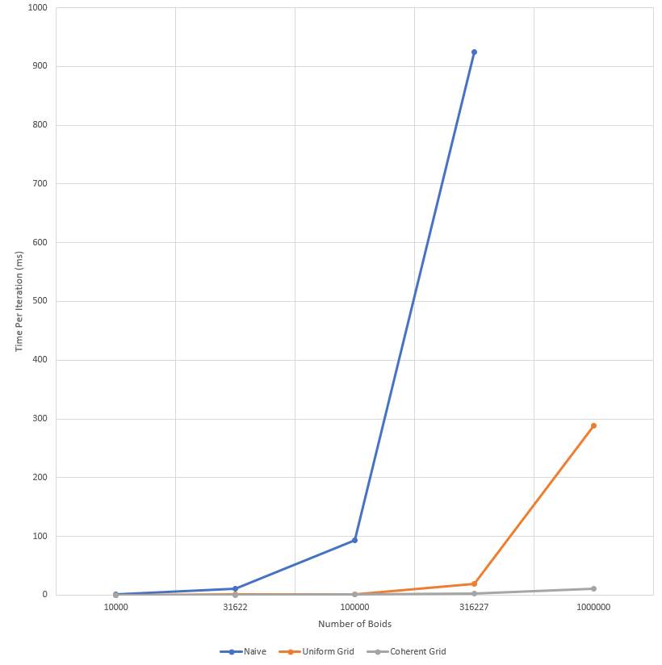
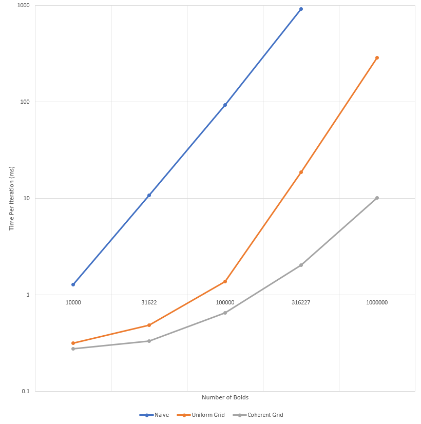
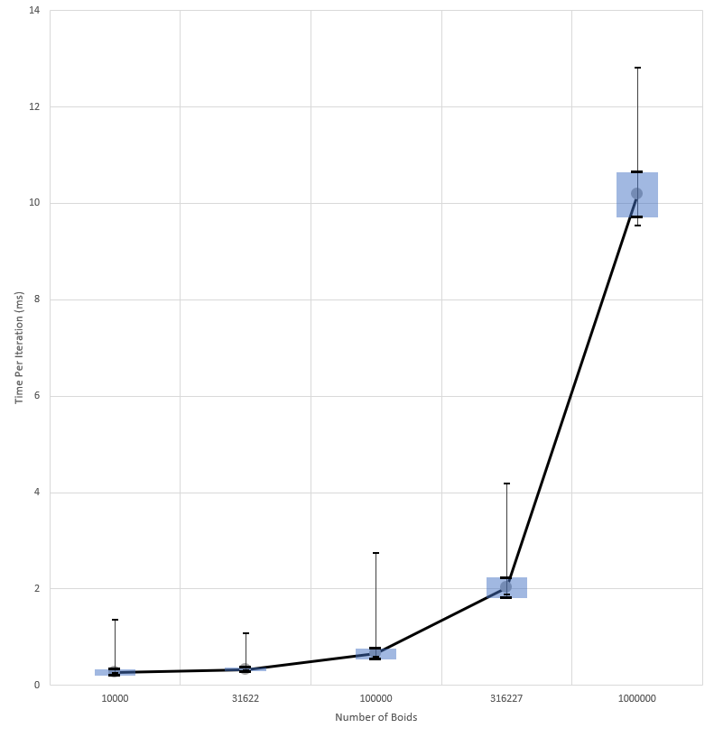
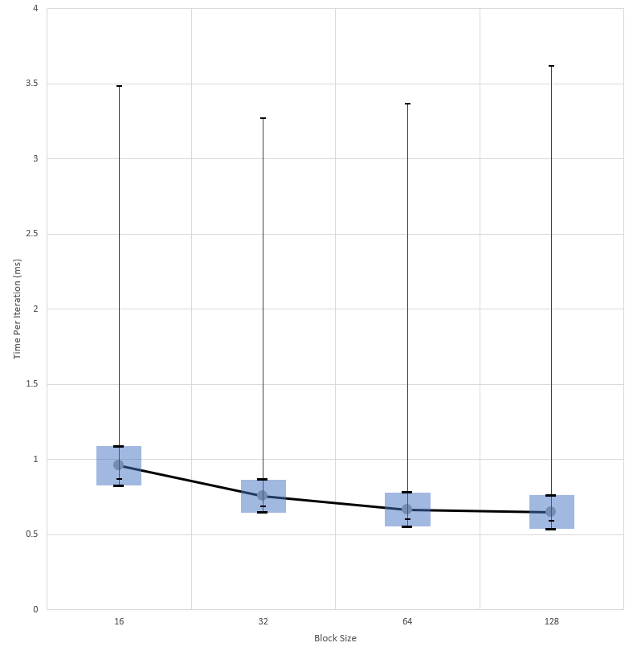
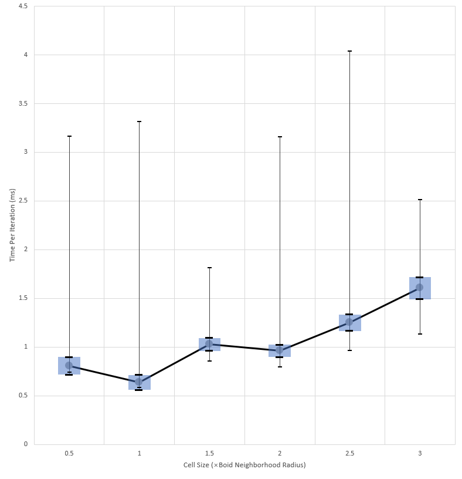

**University of Pennsylvania, CIS 565: GPU Programming and Architecture,
Project 1 - Flocking**

* Xuanyi Zhou
  * [LinkedIn](linkedin.com/in/xuanyi-zhou-661365192)
  * [GitHub](https://github.com/lukedan)
* Tested on: Windows 10, i7-9750H @ 2.60GHz 32GB, RTX 2060 6GB (Personal Laptop)

# Results

# Performance Analysis

## Questions

- **Q: For each implementation, how does changing the number of boids affect performance? Why do you think this is?**

  A: The more boids there are, the longer it takes to simulate one time step. The naive implementation is `O(N^2)`. For the grid-based implementations, when there are relatively few boids, the expected number of boids in one boid's neighborhood is constant, so the time complexity is `O(N)` at this point. However, as the number of boids increase, it'll converge towards `O(N^2)` as well since the simulation happens in a finite volume. Although the computation happens on the GPU, it can only reduce computation time by a constant factor when the number of boids increases beyond the amount of available computation hardware.

- **Q: For each implementation, how does changing the block count and block size affect performance? Why do you think this is?**

  A: From my profiling, it seems that increasing block size reduces computation time. My hypothesis is that increasing block size reduces the amount of scheduling that needs to be done. The reason could also be that the warp size is larger than the block size, preventing the full utilization of computation hardware; however, this is not supported by profiling since there's still some improvement when changing the block size from 32 to 64.

- **Q: For the coherent uniform grid: did you experience any performance improvements with the more coherent uniform grid? Was this the outcome you expected? Why or why not?**

  A: Yes. This is slightly surprising considering the extra amount of copying that needs to be done. Apparently in this case the cost of gathering/scattering from one set of buffers to another and back is far less than that of large amounts of incoherent memory accesses.

- **Q: Did changing cell width and checking 27 vs 8 neighboring cells affect performance? Why or why not? Be careful: it is insufficient (and possibly incorrect) to say that 27-cell is slower simply because there are more cells to check!**

  A: Yes. Using 27 cells is actually faster in my profiling. Since the cells are smaller, the volume of 27 half-size cells is smaller than 8 full-size cells by over a half. This would allow each thread to check a smaller number of boids, and would be quite beneficial when the total number of boids is large.

## Profiling

CUDA events are used to record the execution time of each timestep. See `data.xlsx` for raw data and graphs.

### Average Execution Time of All Versions With Respect to the Number of Boids

### Average Execution Time of All Versions With Respect to the Number of Boids, Logarithm Scale

### Execution Time of the Coherent Grid Version With Respect to the Number of Boids

### Execution Time of the Coherent Grid Version With Respect to Block Size

This is tested using 100000 boids.

### Execution Time of the Coherent Grid Version With Respect to Cell Size

This is tested using 100000 boids.

