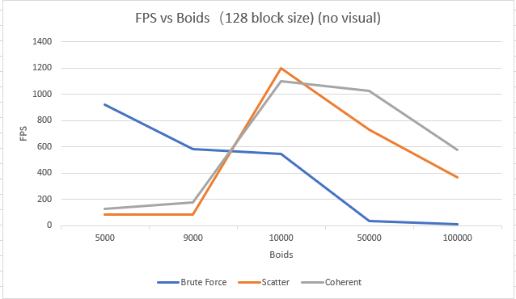
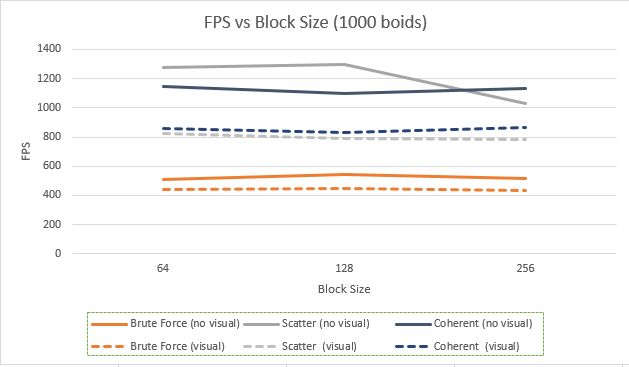

**University of Pennsylvania, CIS 565: GPU Programming and Architecture,
Project 1 - Flocking**

* Li Zheng
  * [LinkedIn](https://www.linkedin.com/in/li-zheng-1955ba169)
* Tested on: Windows CUDA10, i5-3600 @ 3.59GHz 16GB, RTX 2060 6GB (personal computer)
### Boids Animation
   

### Performance Analysis
 
When the number of boids is less than about 10000, the brute force method has a higher frame rate. In case the number of boids is more than about 10000, the scatter and coherent has better performance. The scatter method is generally better than the coherent method. The brute force method calculates velocity change naively based on all the boids. But the other two methods do many additional works. They should calculate the uniform grids and sort them. So, when the number of boids is relatively large, the scatter and coherent method has a better performance.

With visualization disabled, the frame rate is munch better. Obviously, displaying the calculating result on the screen takes time to render. 

  
The change of block size grid doesn’t obviously affect the performance. 
