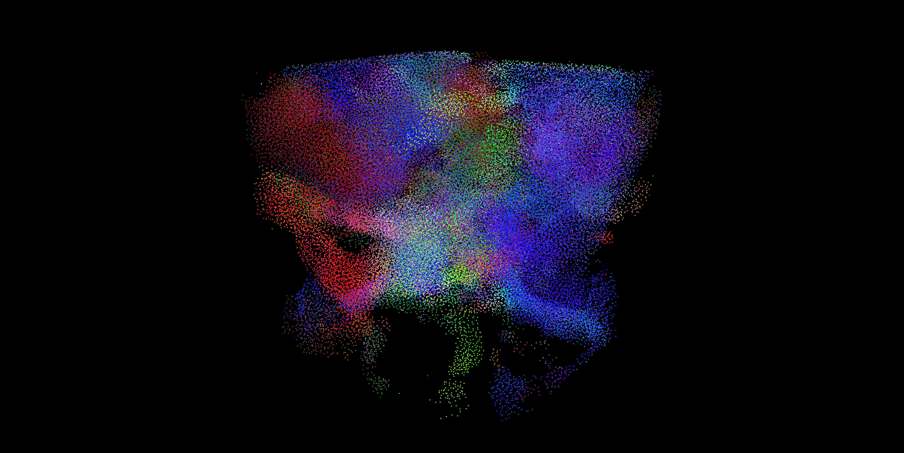
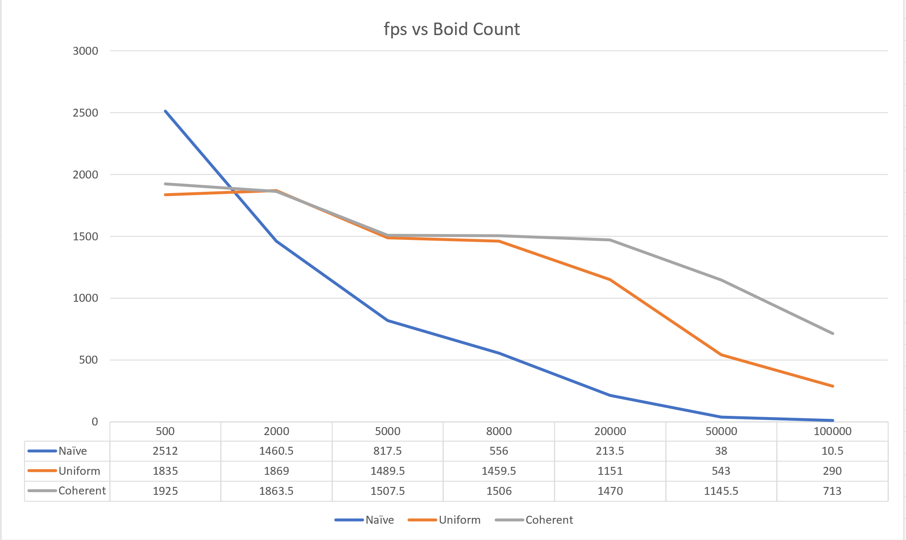

<h1> CUDA Flocking Simulation with Reynold Boids Algorithm
 
 **University of Pennsylvania, CIS 565: GPU Programming and Architecture,
Project 1 - Flocking**

* Haorong Yang
  * [LinkedIn](https://www.linkedin.com/in/haorong-henry-yang/)
* Tested on: Windows 10 Home, i7-10750H @ 2.60GHz 16GB, GTX 2070 Super Max-Q (Personal)

# 

**University of Pennsylvania, CIS 565: GPU Programming and Architecture,
Project 1 - Flocking**

* Haorong Yang
  * [LinkedIn](https://www.linkedin.com/in/haorong-henry-yang/)
* Tested on: Windows 10 Home, i7-10750H @ 2.60GHz 16GB, GTX 2070 Super Max-Q (Personal)

Comparison of 3 methods of step simulation (Naive Search, Uniform Grid, Coherent Grid):

