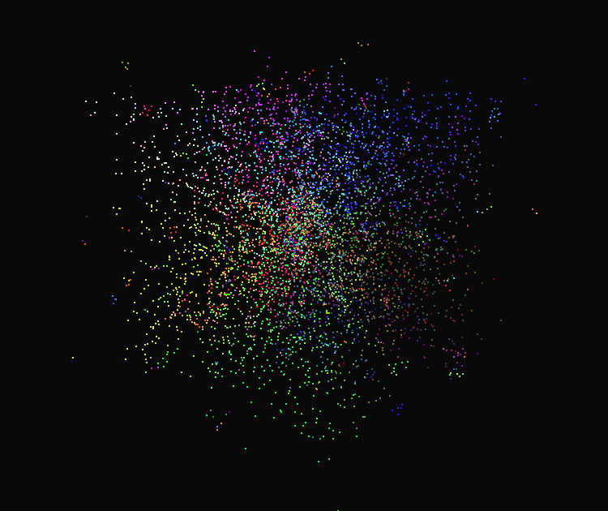
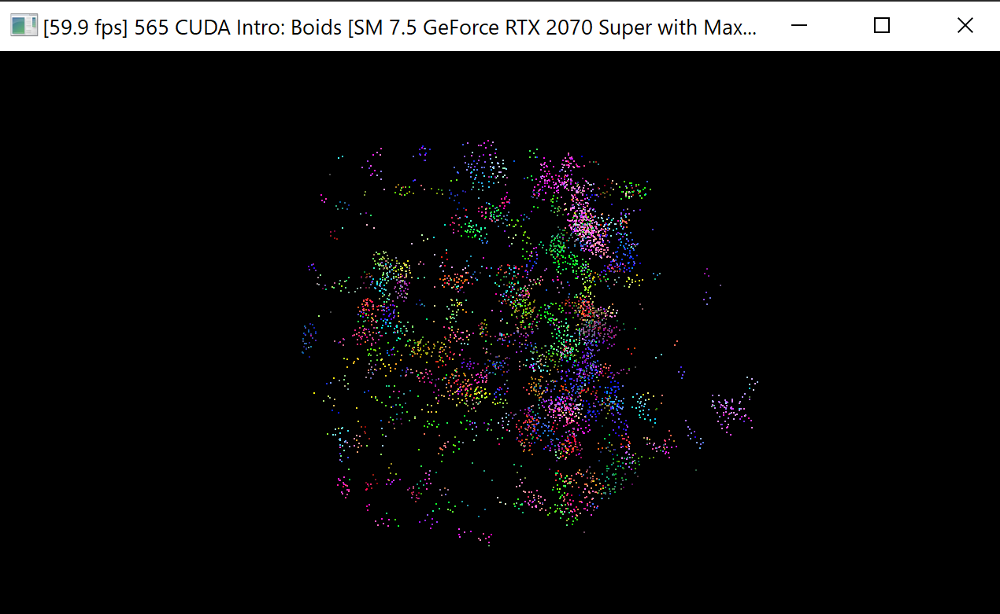
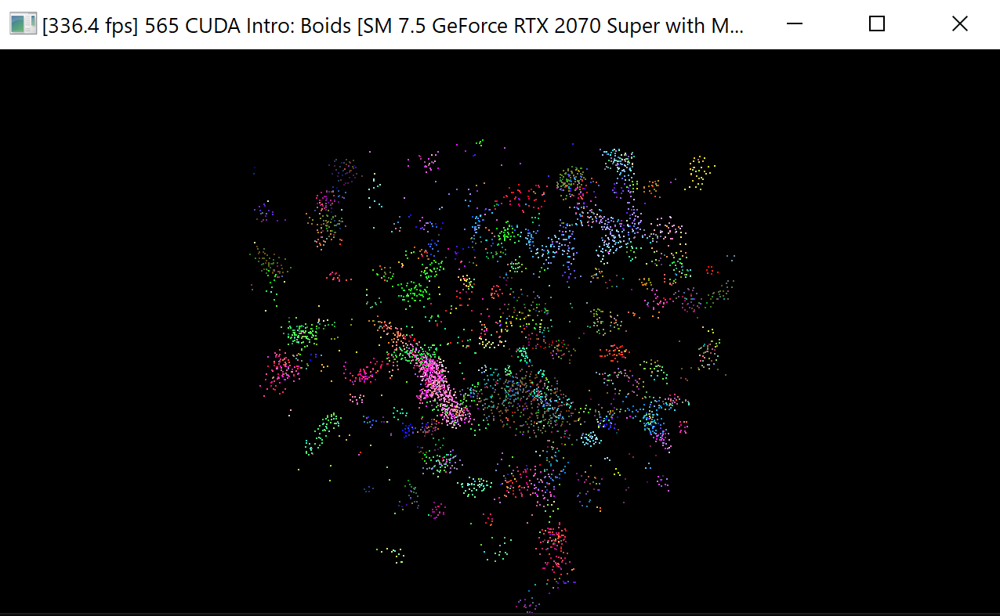
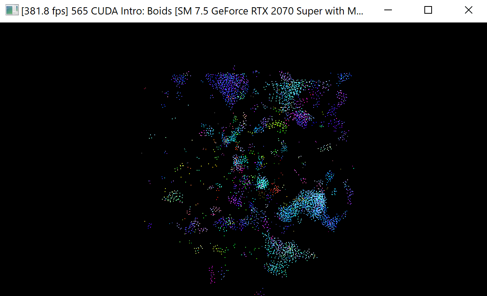

**University of Pennsylvania, CIS 565: GPU Programming and Architecture,
Project 1 - Flocking**

* Janine Liu
  * [LinkedIn](https://www.linkedin.com/in/liujanine/), [personal website](https://www.janineliu.com/).
* Tested on: Windows 10, i7-10750H CPU @ 2.60GHz 16GB, GeForce RTX 2070 8192 MB (personal computer)

### Boids Simulation

Turning off vertical sync makes my FPS go way beyond 60 fps. I have included gifs at 60fps for consistency, then at 

## Naive Implementation

## Uniform Grid

#Grid Looping Optimization

Instead of hard-coding a search of the designated area, limit the search area based on the grid cells that have any aspect of them within the max_distance. This prevents the excessive positional comparisons with the corner points of each grid cell, while at the same time also allowing a more flexible approach (since we're just defining a min cell index and max cell index in all three cardinal directions). That is, there is no longer a manual check for a hard-coded specific number of surrounding cells depending on the implementation (such as the 8 surrounding cells, 27 surrounding cells, etc).

## Coherent Data Buffers
