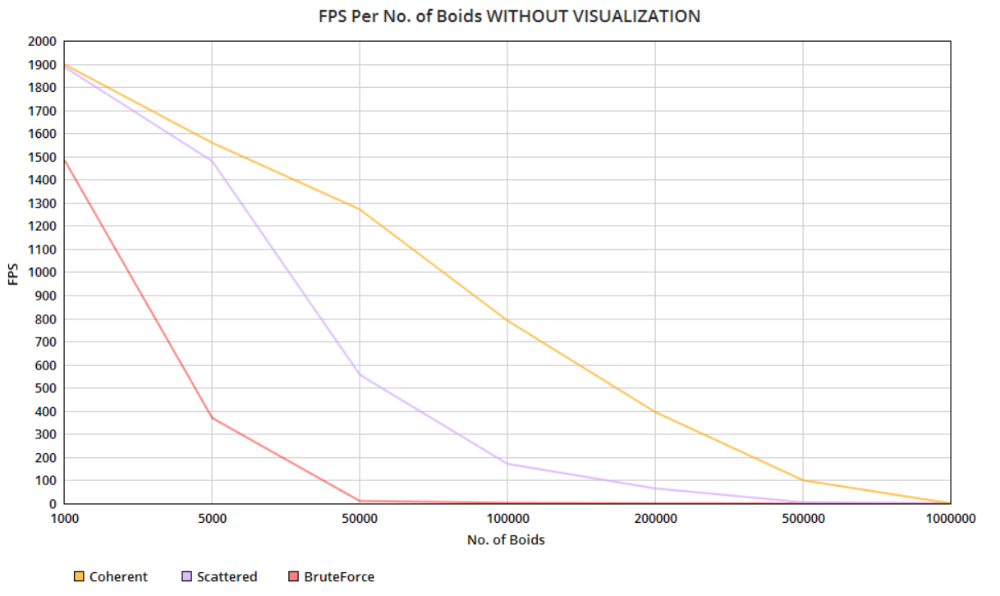

## SIREESHA PUTCHA 
	
*    [LinkedIn](https://www.linkedin.com/in/sireesha-putcha/)

*   [Facebook](https://www.facebook.com/sireesha.putcha98/)

*    [Portfolio](https://sites.google.com/view/sireeshaputcha/home)

*   sireesha@seas.upenn.edu


Tested on personal computer - Microsoft Windows 10 Pro, 
Processor : Intel(R) Core(TM) i7-9750H CPU @ 2.60GHz, 2601 Mhz, 6 Core(s), 12 Logical Processor(s) 
GPU : NVIDIA GeForce RTX 2060

## OUTPUT 
* 500,000 Boids using Coherent Grid 


* 100,000 Boids using Coherent Grid 


## CUDA FLOCKING 

### Boids with Naive Neighbor Search - BruteForce Method 

In the Boids flocking simulation, particles representing birds or fish
(boids) move around the simulation space according to three rules:

1. cohesion - boids move towards the perceived center of mass of their neighbors
2. separation - boids avoid getting to close to their neighbors
3. alignment - boids generally try to move with the same direction and speed as
their neighbors

These three rules specify a boid's velocity change in a timestep.
At every timestep, a boid thus has to look at each of its neighboring boids
and compute the velocity change contribution from each of the three rules.
Thus, a bare-bones boids implementation has each boid check every other boid in
the simulation.

PseudoCode : 

#### Rule 1: Boids try to fly towards the centre of mass of neighbouring boids

```
function rule1(Boid boid)

    Vector perceived_center

    foreach Boid b:
        if b != boid and distance(b, boid) < rule1Distance then
            perceived_center += b.position
        endif
    end

    perceived_center /= number_of_neighbors

    return (perceived_center - boid.position) * rule1Scale
end
```

#### Rule 2: Boids try to keep a small distance away from other objects (including other boids).

```
function rule2(Boid boid)

    Vector c = 0

    foreach Boid b
        if b != boid and distance(b, boid) < rule2Distance then
            c -= (b.position - boid.position)
        endif
    end

    return c * rule2Scale
end
```

#### Rule 3: Boids try to match velocity with near boids.

```
function rule3(Boid boid)

    Vector perceived_velocity

    foreach Boid b
        if b != boid and distance(b, boid) < rule3Distance then
            perceived_velocity += b.velocity
        endif
    end

    perceived_velocity /= number_of_neighbors

    return perceived_velocity * rule3Scale
end
```

### Uniform Grid 

Any two boids can only influence each other if they are
within some *neighborhood distance* of each other.
Based on this observation, we can see that having each boid check every
other boid is very inefficient, especially if (as in our standard parameters)
the number of boids is large and the neighborhood distance is much smaller than
the full simulation space. We can cull a lot of neighbor checks using a
datastructure called a **uniform spatial grid**.

A uniform grid is made up of cells that are at least as wide as the neighborhood
distance and covers the entire simulation domain.
Before computing the new velocities of the boids, we "bin" them into the grid in
a preprocess step.


If the cell width is double the neighborhood distance, each boid only has to be
checked against other boids in 8 cells, or 4 in the 2D case.


You can build a uniform grid on the CPU by iterating over the boids, figuring out
its enclosing cell, and then keeping a pointer to the boid in a resizeable
array representing the cell. However, this doesn't transfer well to the GPU
because:

1. We don't have resizeable arrays on the GPU
2. Naively parallelizing the iteration may lead to race conditions, where two
particles need to be written into the same bucket on the same clock cycle.

Instead, we will construct the uniform grid by sorting. If we label each boid
with an index representing its enclosing cell and then sort the list of
boids by these indices, we can ensure that pointers to boids in the same cells
are contiguous in memory.

Then, we can walk over the array of sorted uniform grid indices and look at
every pair of values. If the values differ, we know that we are at the border
of the representation of two different cells. Storing these locations in a table
with an entry for each cell gives us a complete representation of the uniform
grid. This "table" can just be an array with as much space as there are cells.
This process is data parallel and can be naively parallelized.


### Coherent Grid  
The uniform grid neighbor search outlined in 2.1: pointers to boids in
a single cell are contiguous in memory, but the boid data itself (velocities and
positions) is scattered all over the place. We can rearrange the boid data
itself so that all the velocities and positions of boids in one cell are also
contiguous in memory, so this data can be accessed directly using
`dev_gridCellStartIndices` and `dev_gridCellEndIndices` without
`dev_particleArrayIndices`.


## PERFORMANCE ANALYSIS 
Below are the graphs that depict how the number of boids in simulation affect the frame rate. The first Graph shows the relationship when Visualization is turned on and the second one when turned off. The Third graph shows how the blocksize corresponds to changes in FPS. I have used 100,000 boids for this simulation and the block sizes vary from 128 to 1024. The last graph depicts the changes in GridCell width used for different no. of boids in simulation using a coherent grid. 

* FPS Per Number of Boids 


We clearly see the difference when using a coherent grid vs. using brute force approach. Even with 500,000 boids when using a coherent grid, we could achieve close to 100fps. 

* FPS Per Number of Boids without Visualization 


FPS is significantly higher when visualization is turned off reaching a high of almost 1900 fps for 100 boids using a coherent grid. 

* FPS per BlockSize 


Performance of each individual method is almost same when using different block sizes. The combination that works best for me is block size 256 using coherent grid.  

* FPS per GridCellWidth


We can see that using the cell size : 2 * neighboring dist works well with the size 50,000 boids but the performance drops when using 100,000 boids. A cell size : neighboring dist is more consistent with increasing no. of boids. 

**Answers:**

* For each implementation, how does changing the number of boids affect
performance? Why do you think this is?

The performance decreases as we increase the no. of boids. As the count increases, the system has to perform more and more checks and 
hence we see a drop in fps consistently. We can improve the performance by using spatial data structures like uniform grid and coherent grid. 
Also, using a very low count of boids is also not ideal since the overhead of setting up the gpu pipeline and running the process in parallel 
overweighs the increase in efficiency. According to me, goid count of 5K to 50K works best for this algorithm. However, higher the no. of boids, 
lower the performance. 

* For each implementation, how does changing the block count and block size
affect performance? Why do you think this is?

Changing the block size and count doesn't alter the performance too much. The fps for all 3 methods is almost consistent when using block sizes 128, 256, 512 and 1024. 
This is because the no. of threads running are the same (32 since it is the warp size) for each of these block sizes. 

* For the coherent uniform grid: did you experience any performance improvements
with the more coherent uniform grid? Was this the outcome you expected?
Why or why not?

Yes, the coherent grid improves the performance compared to the original uniform grid. This is an expected outcome since we remove the extra step of 
looking for the position and velocity using particleArrayIndices for all the boids in neighboring gridcells which fall under the search radius. 
Instead, we arrange the position and velocities by grouping them based on the gridcell the boid is in so they are in a continuous array. 

* Did changing cell width and checking 27 vs 8 neighboring cells affect performance?
Why or why not? Be careful: it is insufficient (and possibly incorrect) to say
that 27-cell is slower simply because there are more cells to check!

Both using 27 and 8 neighboring cells gives an almost similar result for smaller counts of boids. As we get to higher counts, 
say 100,000 as shown in the graph, performance is higher when checking 27 cells. A the cell size for the 8 cells is higher, 
it takes longer to determine the neighboring cells compared to looping over smaller sized 27 cells. 
