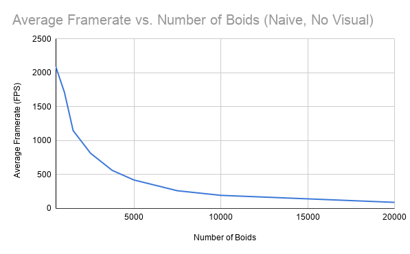

**University of Pennsylvania, CIS 565: GPU Programming and Architecture,
Project 1 - Flocking**

* Janine Liu
  * [LinkedIn](https://www.linkedin.com/in/liujanine/), [personal website](https://www.janineliu.com/).
* Tested on: Windows 10, i7-10750H CPU @ 2.60GHz 16GB, GeForce RTX 2070 8192 MB (personal computer)

This project involved a flocking simulation based on [Conard Parker's notes](http://www.vergenet.net/~conrad/boids/pseudocode.html) on the Reynolds Boids algorithm, with three different setups / implementations that were compared for performance.

## Performance Analysis Methods

The main measure of the simulation's performance is its, displayed in the top left corner of the window when the simulation runs.

I wasn't able to figure out how to capture my frames per second with the performance analyzer, so instead of eyeballing an average, I gathered data by recording the application window for fifteen seconds. Using this video, data points could be created for the framerate at every second in the recording, and then plotted on time graphs as shown in the following sections. Since the graphic visuals of the simulation take resources to update (reducing the framerate of the simulation), I have also taken framerate data for when this visualizer is turned off. Disabling vertical sync on my device results in a framerate *far* exceeding 60fps, even with visualization:

When the simulation starts, the first two values shown are always "0.0 fps", followed by an outlier number that is much higher or lower than the rest of the values for that trial. Therefore, when I take the average framerate from my data, I discount these two numbers so the average is a more accurate representation of the framerate once its initial spikes have settled.

## Naive Implementation

In the naive implementation of this simulation, every boid checks against all other boids to calculate its velocity, even those that should have been outside of its search radius. The framerates for this version were captured on my computer with a count of 5000 boids.

This method is essentially an O(n^2) algorithm; with a large number of boids in the simulation, the squared amount of time that this method takes results in the lowest framerate of the three implementations. To confirm this, I measured the average framerate for a varying number of boids in the unvisualized simulation, resulting in the inverse parabolic trajectory shown:

(I did not test farther than 20000 boids because at that amount of boids, the application was struggling to exit.)

In addition to varying the number of boids in the simulation, I also experimented with different block sizes (and thus different block counts) for the kernels involved in the simulation. The hardware limitation of 1024 threads in an SM means that the largest block size I can test is 1024 threads per block (1 block).

The default block size in the simulation is 128 threads per block; it seems to be the most optimal, as it has the maximum average framerate of all other block sizes. The smaller block sizes have a slight decrease in performance, but not as significant as that of the larger block sizes. Since an SM runs 8 threads in a cycle, putting them in larger blocks requires the SMs assigned to them to use more warp cycles, resulting in more latency between each set of threads in a block. For the slight framerate drop with the smaller block sizes, at first it seems that breaking up the blocks into smaller sizes would mean a wider distribution of blocks that are executed more quickly, but there *are* more blocks to assign to cores. Perhaps the small performance decrease is due to the overhead cost of managing a higher number of blocks.

## Uniform Grid

The first optimiziation of this simulation is a uniform grid that is mapped onto the 3D space the boids move in. Instead of having each boid check against all other boids in the simulation, the boids will search for neighbors in adjacent cells (the number of which is based on the width of the cell in relation to the max rule distance).

Clearly, a drastic improvement from the naive implementation. The framerate is more than three times higher than the framerate for the naive algorithm at 5000 boids, and for varying numbers of boids, the framerate is always higher. I can even test beyond 20000 boids and maintain a framerate higher than 1000 fps.

There is an overall downward curve to the graph, but it sharply contrasts the graph for the naive implementation; where the naive implementation's framerate converged at a small number by 20000, the uniform grid allows the framerate to maintain a fairly high trajectory even as the number of boids increases by ten-thousand increments. However, there are intermediate peaks and dips that are not well explained due to the spread of data points. I decided to make a more shapely graph by gathering more data around the points I already had, but instead of formally averaging the FPS over several seconds, I eyeballed the FPS counter at every number. These less accurate points intend to more clearly define the sudden drops in framerate around certain numbers of boids.

There is a dramatic drop in two places: about 400 fps between 4800 and 4900 boids, and around 325 fps between 29500 boids to 30000 boids. I am unsure why it is these numbers specifically that cause such spikes, and why they do not transition smoothly downwards like the rest of the graph does.

##Grid Looping Optimization

When I was implementing the uniform grid search, I did not realize we could hardcode eight or twenty-seven cube; I thought that our radius should accommodate changes in the neighbor distances, not realizing this is extra credit. But regardless, my implementation tests for the maximum distance, then examines all the neighbhoring cells within that distance (in a cube pattern) to see which boids influence this one. This makes it flexible, but it still causes cubes. 

This source ([x](https://stackoverflow.com/questions/4578967/cube-sphere-intersection-test)) helped me to implement this optimization.

Reason that 27 takes so much time is that there's more probability to have boids that are out of bounds of the thing that are checked anyway. The corners of the ; more corner area means more potential unnecessary checks, and since these boids are fairly close to one another because of the flocking behavior, there are probably a good number of checks.

1350 fps with gridwidth 5 * distance

about same with 2 * gridwidth distance

1750 fps with gridwidth distance

1550 fps with gridwidth .5 * distance

## Coherent Data Buffers

The second optimization involves semi-coherent data buffers, with one less level of indirection between the data buffers used for this simulation. This intends to remedy the random accessing of global memory that was included in the original uniform grid implementation. By accessing an array in global memory with a continuous trajectory, we speed up the process.

Comparison of all three

As expected, the coherent data buffers with the uniform grid does perform better than the uniform grid alone.

;
