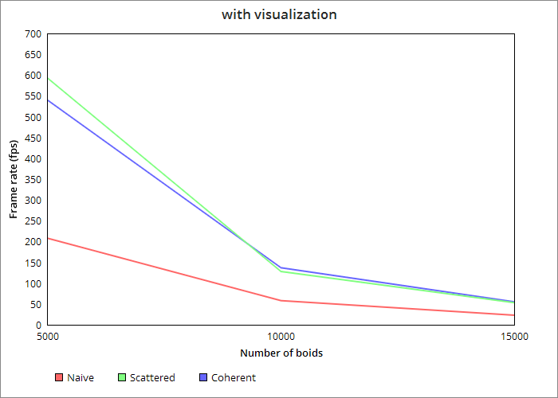

**University of Pennsylvania, CIS 565: GPU Programming and Architecture,
Project 1 - Flocking**

* Han Yan

* Tested on: CETS Virtual Lab

### (TODO: Your README)

Include screenshots, analysis, etc. (Remember, this is public, so don't put
anything here that you don't want to share with the world.)

## Part 3: Performance Analysis

* As the number of boids increases, the performance of all implementations decrease, but with different rate. For the naive implementation, it's the most prone to be affected, as for every frame, it has to check for all the boids. In comparison, increasing number of boids has milder effect on the scattered uniform and coherent implementations, since if there are k more boids, neither implementation needs to check for all the k boids in the kernel. Another relevant factor here is sorting. But since we are using parallel sorting, it should have little effect on the performance compared to the iteration.

* Changing the block size or block count doesn't affect the overall performance a lot. The total number of threads equal the total number of boids, so changing the block size / block cound only affects the organization of threads.

* I don't see any performance improvement with more coherent uniform grid, since having more grid does not affect the number of neighboring boids that need to be checked.

* Checking 27 vs 8 neighboring cells slightly reduces the performance, but not significant. Although there are more cells to check, the total number of neighboring boids being checked remains the same. The lower performance results from having a larger grid array. 

## Part 4: Write-up

### Simulation (some parts are laggy since I recorded from my host computer)

### Changing number of boids

### Changing block size

