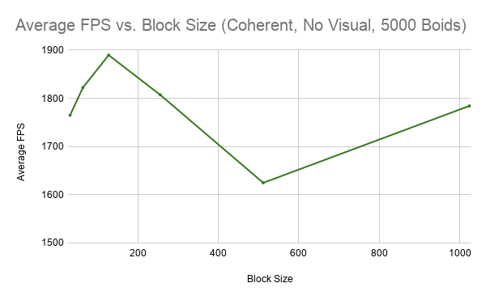

**University of Pennsylvania, CIS 565: GPU Programming and Architecture,
Project 1 - Flocking**

* Janine Liu
  * [LinkedIn](https://www.linkedin.com/in/liujanine/), [personal website](https://www.janineliu.com/).
* Tested on: Windows 10, i7-10750H CPU @ 2.60GHz 16GB, GeForce RTX 2070 8192 MB (personal computer)

This project involved a flocking simulation based on [Conard Parker's notes](http://www.vergenet.net/~conrad/boids/pseudocode.html) on the Reynolds Boids algorithm, with three different setups / implementations that were compared for performance.

## Performance Analysis Methods

The main measure of the simulation's performance is its, displayed in the top left corner of the window when the simulation runs.

I wasn't able to figure out how to capture my frames per second with the performance analyzer, so instead of eyeballing an average, I gathered data by recording the application window for fifteen seconds. Using this video, data points could be created for the framerate at every second in the recording, and then plotted on time graphs as shown in the following sections. Since the graphic visuals of the simulation take resources to update (reducing the framerate of the simulation), I have also taken framerate data for when this visualizer is turned off.

Disabling vertical sync on my device results in a framerate *far* exceeding 60fps, even with visualization:

When the simulation starts, the first value shown is always "0.0 fps", followed by an outlier number that is much higher or lower than the rest of the values for that trial. Therefore, when I take the average framerate from my data, I discount these two numbers so the average is a more accurate representation of the framerate once its initial spikes have settled.

## Naive Implementation

In the naive implementation of this simulation, every boid checks against all other boids to calculate its velocity, even those that should have been outside of its search radius. The framerates for this version were captured on my computer with a count of 5000 boids.

This method is essentially an O(n^2) algorithm; with a large number of boids in the simulation, the squared amount of time that this method takes results in the lowest framerate of the three implementations. To confirm this, I measured the average framerate for a varying number of boids in the unvisualized simulation, resulting in the inverse parabolic trajectory shown:

(I did not test farther than 20000 boids because at that amount of boids, the application was struggling to exit.)

In addition to varying the number of boids in the simulation, I also experimented with different block sizes (and thus different block counts) for the kernels involved in the simulation. The hardware limitation of 1024 threads in an SM means that the largest block size I can test is 1024 threads per block (1 block).

The default block size in the simulation is 128 threads per block; it seems to be the most optimal, as it has the maximum average framerate of all other block sizes. The smaller block sizes have a slight decrease in performance, but not as significant as that of the larger block sizes. Since an SM runs 8 threads in a cycle, putting them in larger blocks requires the SMs assigned to them to use more warp cycles, resulting in more latency between each set of threads in a block. For the slight framerate drop with the smaller block sizes, at first it seems that breaking up the blocks into smaller sizes would mean a wider distribution of blocks that are executed more quickly, but there *are* more blocks to assign to cores. Perhaps the small performance decrease is due to the overhead cost of managing a higher number of blocks. The magnitude of the difference of fps between the 128 threads per block and the 1024 threads per block is about 100 fps.

## Uniform Grid

The first main optimization of this simulation is a uniform grid that is mapped onto the 3D space the boids move in. Instead of having each boid check against all other boids in the simulation, the boids will search for neighbors in adjacent cells (the number of which is based on the width of the cell in relation to the max rule distance).

Clearly, the uniform grid's performance is a drastic improvement from the naive implementation. The framerate is more than three times higher than the framerate for the naive algorithm at 5000 boids, and for varying numbers of boids, the framerate is always higher. I can even test beyond 20000 boids and maintain a framerate higher than 1000 fps.

There is an overall downward curve to the graph, but it sharply contrasts the graph for the naive implementation; where the naive implementation's framerate converged at a small number by 20000, the uniform grid allows the framerate to maintain a fairly high trajectory even as the number of boids increases by ten-thousand increments. However, there are intermediate peaks and dips that are not well explained due to the spread of data points. I decided to make a more shapely graph by gathering more data around the points I already had, but instead of formally averaging the FPS over several seconds, I eyeballed the FPS counter at every number. These less accurate points intend to more clearly define the sudden drops in framerate around certain numbers of boids.

There is a dramatic drop in two places: about 400 fps between 4800 and 4900 boids, and around 325 fps between 29500 boids to 30000 boids. I am unsure why it is these numbers specifically that cause such spikes, and why they do not transition smoothly downwards like the rest of the graph does.

Like the naive implementation, the framerate is affected by the number of threads in a block, demonstrated below.

For the most part, this graph follows the same shape as the one for the naive implementation. There is an out-of-place peak at 32 threads per block, but the magnitude of the difference is 17 fps, and may be a result of high fluctuation while the data was being collected.

### Grid Looping Optimization

When I was implementing the uniform grid search, I did not realize we could hardcode a eight or twenty-seven cube search area. I thought that our radius should accommodate changes in the neighbor distances, not realizing this part is extra credit. But regardless, my implementation does not search cells with a fixed number that needs to be adjusted with the cell width and neighbor distance; it dynamically tests for the maximum distance, then examines all the neighboring cells within that distance (still in a cube pattern) to see which boids influence this one. This makes it flexible, so the cell width and neighbor distance can be adjusted without affecting the algorithm. 

To experiment with the benefits of the grid, I observed the performance of the simulation when the cell width (and therefore the number of cells in the grid) were changed. This was a more informal process, since I just eyeballed the frames per second as a result of each modification. Still, the simulation's performance clearly suffers when the grid is not well-fitted to the maximum search radius for neighbor boids. If the cells are much bigger or smaller than the neighbor radius, then the framerate drops a couple hundred frames per second either way. Logically, if the cells are too big with respect to the neighbor distance, then they will contain too many boids that are way outside of the preset radius. On the other hand, if the cells are too small, then there are a larger number of them to check that isn't worth their size (these cells were less wide than the neighbhor distance). The boids will check the same neighbors if the cells are as big as the radius, and more efficiently. Therefore, there is a balance that must be struck between these two sides in order for the grid to be most effective.

An issue with using a cube-shaped space is that the radius functions as a sphere, meaning that the corners of the cube are often outside the neighbor search radius, yet are counted anyway because they are a part of the cube. Including these corners means that there is a higher probability to have boids that are out of bounds unnecessarily examined; the more corner area, the more potential unnecessary checks. Since these boids are fairly close to one another due to the flocking behavior, there are probably a good number of these unsuccessful checks made throughout the simulation.

I attempted to refine my algorithm by testing if the cells were inside the sphere of that radius. This source ([x](https://stackoverflow.com/questions/4578967/cube-sphere-intersection-test)) helped me to implement this feature. However, when I tested it on the grids with 5000 boids, the framerate actually dropped a bit rather than increasing. I suppose that this would be more effective in very crowded simulations, or in certain ratios between the cell width and neighbor distance. I have not experimented enough with these to prove when / how this optimization is actually effective. So for now, the corners are still included in the neighbor search.

## Coherent Data Buffers

The second main optimization involves semi-coherent data buffers, with one less level of indirection between the data buffers used for this simulation. This intends to remedy the random accessing of global memory that was included in the original uniform grid implementation. By accessing an array in global memory with a continuous trajectory, we speed up the performance of the simulation by a substantial amount.

Here is a comparison of all three implementation's framerates:

As expected, the coherent data buffers with the uniform grid does perform better than the uniform grid alone, and both greatly overshadow the performance of the naive algorithm. The coherent grid's outperformance of the uniform grid confirms that contiguous global memory access does outperform random memory access; the coherent grid implementation maintains a consistent 150 fps or so above the framerate of the uniform grid.

Varying the number of boids for the coherent grid causes behavior similar to the uniform grid:

The same intense peaks occur for the same amount of boids in both the uniform grid and the coherent grid implementations. Therefore, it's the grid feature specifically that is causing some numbers of boids to have worse performance than others, but the reason is still unclear. Regardless, the coherent grid still outperforms the uniform grid with these boid number changes. A comparison of all three trajectories is below.

As with the other implementations, the coherent grid implementation was tested with different block sizes, with the results appearing more dramatic in scale. The difference between the maximum and minimum in this graph is 300fps, as opposed to the 100fps of the other two graphs. The trajectory is about the same, with the exception of the extremely low outlier at 512 threads per block. The block size of 128 still appears to be the ideal.

